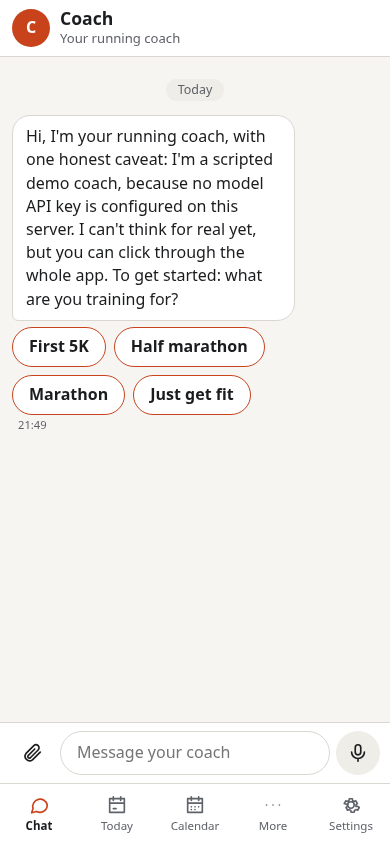
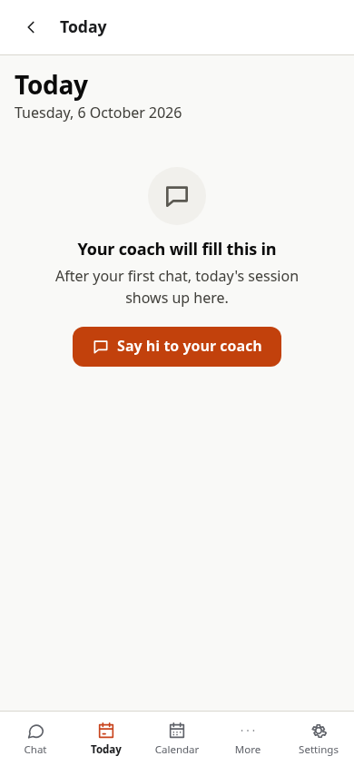
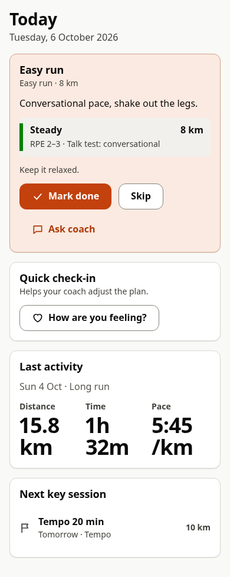
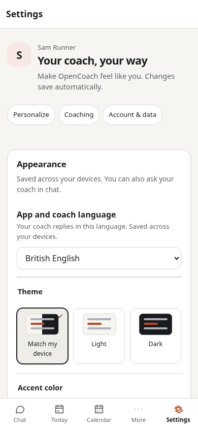
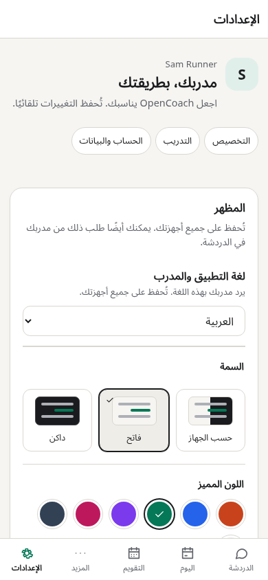

# OpenCoach

**A self-hosted running coach you talk to in a browser.** Tell it your goal, report a run, or send a screenshot or file. With a model provider configured, the AI can maintain your training data, write a plan, remember previous conversations, and schedule check-ins. You control its quiet hours, spending limits, notifications, and access to your data.

This repository contains a **working v0.1 web app and server**. You run the server yourself, then open the app on a computer or phone. It is not an app-store release. Start with the free, scripted demo below to see the interface before connecting a paid AI provider.

## What the app looks like

The app opens into chat. A navigation bar switches between chat and training screens. With the four bundled views, **Plan** and **Progress** are under **More**, including on desktop. Settings is always available.

| Screen | What you can do |
|---|---|
| **Chat** | Talk to the coach, tap quick replies, preview attachments, and discuss something from another screen. The message box grows with your text and saves unsent drafts on this device. Record, listen to, then send voice notes when a speech provider is configured. |
| **Today** | See today's workout, mark it done or skipped, record a subjective check-in, and ask about a session. |
| **Calendar** | Browse planned workouts, recorded activities, and races; move a planned workout to another date. |
| **Plan** | Read the current training block, planned weekly volume, key sessions, race goal, and a plain-language "Why this plan" explanation. Ask in chat to change the plan. |
| **Progress** | See recorded distance, longest runs, easy-run pace, and consistency over time. |
| **Settings** | Personalize language, light/dark mode and colors; change units, time zone, quiet hours, pause mode, message/cost limits, and privacy preferences; manage devices, export data, and delete your account. |

These are the four bundled training screens. A real coach can also propose changes to its screens; publication must pass static, browser, accessibility, and performance checks. Chat and Settings belong to the app and remain available independently of those changes.

In **Settings → Appearance**, choose English, Dutch or Arabic (including right-to-left layout), a theme and an accent color. These preferences follow your account across devices. You can also ask the coach, for example: “Use Arabic and a green dark theme.” The saved language guides its replies. The shell and current starter views translate their controls; ask the coach to translate its own training explanations or custom views. Other languages currently use English shell labels.

<p>
  
  
  
</p>

The first two screenshots come from the running demo. The third shows the actual Today view with **test data**, to illustrate a populated screen. New accounts start with empty training data. Demo mode does not populate a training plan or activity charts.

<p>
  
  
</p>

On a computer, Enter sends and Shift + Enter adds a line. On a phone, Enter adds a line; tap the send arrow to send. The **+** button adds photos or files. The microphone records a **voice note**: tap it, stop recording, listen if you want, then send or discard. It does not send while you grant microphone permission. Unsent text drafts survive tab switches and reloads; signing out clears them.

Voice notes need HTTPS on your phone and a server-side speech-to-text service. A text-model key such as OpenCode GO alone does not enable transcription. The app explains missing configuration and microphone permission problems; see [voice setup](docs/self-hosting.md#voice-notes).

## What the AI knows about the app

The coach receives instructions explaining that it lives inside OpenCoach, how its memory persists, how to save training records, and how to change its views. It also receives your saved profile and current-week notes, a skill index, tool definitions, conversation history and a report of the current time, budgets and configured capabilities. It reads detailed skills when needed; it does not receive every document at once.

It can delegate analysis, planning, independent review, UI work and research to helpers. A research skill and separate quick/deep research profiles explain source checking, citations, uncertainty and saving findings. Fresh web search requires Brave, Tavily or SearXNG configuration; fetching public pages is separately enabled. The DeepSeek GO example is text-only and has no search backend by default. The coach is told those limits rather than being allowed to assume every feature is configured. See the [context audit](docs/verification/coach-context-audit.md) for what was checked and what remains unverified.

## Try it locally, without an API key

### 1. Prepare your computer

The verified local setup is **Linux** with:

- **Node.js 22.13 or newer** (`node --version`).
- **pnpm 10.28.0** (`pnpm --version`). If needed: `npm install --global pnpm@10.28.0`.
- **Git** and **Python 3**.
- **Unprivileged Linux user namespaces enabled**, so the coach can run commands in an isolated workspace. Startup checks this.

For Windows, use a Linux environment such as WSL2; the local sandbox does not run directly on Windows or macOS. Docker is an alternative described below, but its Linux host/VM still needs to support user namespaces for the supplied Compose configuration.

**Chromium is optional for trying the bundled screens**, but required for the coach to preview and publish screen changes. On Debian/Ubuntu, install it with `sudo apt-get install chromium`, or point `OPENCOACH_CHROMIUM_PATH` at an existing executable.

### 2. Download and build

Run these commands in a terminal. If you already have this repository, start with `cd` into it and skip cloning.

```sh
git clone --branch ccr-a500ac00-ytsl89 https://github.com/sherifnafie/running_coach.git
cd running_coach
pnpm install --frozen-lockfile
pnpm build
```

If you received a `running_coach.bundle` instead, use `git clone --branch ccr-a500ac00-ytsl89 /path/to/running_coach.bundle running_coach` in place of the GitHub clone command. The remaining steps are the same.

### 3. Start the server

From the repository root:

```sh
export OPENCOACH_DATA_DIR="$PWD/.data"
OPENCOACH_DEMO=1 pnpm start
```

Leave this terminal running. The server prints a **setup code** and the app address. Open **http://localhost:8080** in your browser on the same computer.

The explicit data path puts your accounts, conversations, uploads, and coach workspaces in this repository's `.data` directory, which Git ignores. Without it, `pnpm start` defaults to `apps/server/.data`. Use the same data directory every time you restart.

### 4. Create your account

1. Enter the setup code from the terminal. It is also saved in `.data/setup-code.txt` with the data path above.
2. Enter your name and coach name; check the time zone and units.
3. Read and accept the health-data consent, AI disclosure, and confirmation that you are 18 or older.
4. Click **Create my coach**. For a quick trial, click **Skip the rest** on the optional installation, notifications, and passkey steps.

The first account is the deployment administrator. Later accounts need an administrator-issued invite. To add another device to your own account, use pairing or a passkey from Settings; the initial setup code is not a reusable login password.

### 5. Click through the demo

The demo uses scripted responses, not a language model. It makes no paid model calls.

1. Read the welcome message and tap **First 5K** (or another goal).
2. Send **I ran 5k today**, then choose an effort rating such as **4 · easy**. The demo writes the reported effort into a workspace journal file.
3. Send **plan**. The demo schedules a check-in for tomorrow at 08:00; it does **not** generate a training plan. Scheduled work needs the server running, and proactive delivery follows your notification limits and quiet hours.
4. Visit Today, Calendar, Plan, and Progress. Empty states are expected: the demo's journal entry is not a structured activity record.
5. Try changing units or notification preferences in Settings. Refresh the page to see that your account and conversation persist.

You can attach a file to test uploading, but the demo cannot interpret files or images. Connect a capable real model for that.

To stop the server, press **Ctrl+C** in its terminal. To start it again, run the commands in step 3 from the repository root. You do not need to reinstall or rebuild unless the code or dependencies changed. Cached screens and queued actions offer some offline use, but AI replies and synchronization require a connection to your server.

## Connect a real AI coach

Stop the demo server first. Keep the same absolute `OPENCOACH_DATA_DIR` to preserve your account. Provider keys are used by the trusted server and are not passed into coach workspaces.

The simplest provider setup is to export **one** of `ANTHROPIC_API_KEY`, `OPENAI_API_KEY`, or `DEEPSEEK_API_KEY`, then restart with demo mode disabled. For example, in Bash:

```sh
export OPENCOACH_DATA_DIR="$PWD/.data"
read -r -s -p "Anthropic API key: " ANTHROPIC_API_KEY; printf '\n'
export ANTHROPIC_API_KEY
OPENCOACH_DEMO=0 pnpm start
```

The prompt hides the key as you type. Model requests use your provider account and may incur charges. Choose models and limits in [the example configuration](opencoach.config.example.yaml); set `OPENCOACH_CONFIG` to the configuration file's absolute path. The server does **not** automatically read `.env` files. Without credentials or explicit model configuration, it falls back to the scripted demo.

With a real model, start by describing your running history, goal, available days, and constraints. Ask it to create a plan and record runs. Training screens display the structured data the coach writes; sending a sentence alone does not guarantee a chart update. Model behavior and data extraction still need live-provider validation.

### Use OpenCode GO

There is a ready-made compatible-provider configuration for OpenCode GO:

```sh
export OPENCOACH_DATA_DIR="$PWD/.data"
export OPENCOACH_CONFIG="$PWD/opencoach.config.opencode-go.example.yaml"
read -r -s -p "OpenCode GO API key: " OPENCODE_GO_API_KEY; printf '\n'
export OPENCODE_GO_API_KEY
OPENCOACH_DEMO=0 pnpm start
```

Both the configuration path and key are required. The example selects **DeepSeek V4.1 Flash** (`deepseek-v4.1-flash`) for all three tiers at the [official GO endpoint](https://opencode.ai/docs/go/), enables thinking and reasoning replay, uses low effort for ordinary conversation and high effort for deep work, and supplies peak token prices for conservative local budget estimates. No private key is included in the repository.

**Live smoke testing passed on 6 October 2026:** streamed tool calls and continuation, account creation, delivered coach replies, saved intake, a recorded run, training plan, and data displayed in all four screens. The check-in was saved for the requested local time. These bounded tests use synthetic athlete data and do not certify coaching quality or full model conformance. The example keeps image input disabled; this text model is distinct from DeepSeek V4 Flash Vision Exp. See the [verification record](docs/verification/opencode-go-smoke.md) for observed behavior and limits.

## Docker and phone access

The repository also includes Dockerfiles and a Compose deployment. From the repository root on a suitable Linux Docker host:

```sh
mkdir -p .data
OPENCOACH_DEMO=1 docker compose up --build
```

The server image runs as user/group **1000**; `.data` must be writable by that user. Compose stores data there and binds the app and view ports to loopback. The supplied deployment uses isolated local namespaces inside the server container. See [self-hosting](docs/self-hosting.md#sandboxes) for host policy, directory permissions, and the alternative Docker sandbox provider.

The server Dockerfile built successfully on 6 October 2026. Its image started as user/group 1000 with isolated local sandboxes and passed browser signup, delivered demo replies, all four views, and reload. Python analysis libraries and virtual time also passed inside its athlete sandbox. The [verification record](docs/verification/opencode-go-smoke.md) separates these packaging checks from the host-based live model run.

On your phone, `localhost` means the phone itself. To reach the server from another device, configure **two distinct browser-reachable origins**: `PUBLIC_URL` for the app and `VIEWS_URL` for its isolated training screens. Both need HTTPS for normal mobile passkeys, microphone, installation, and push use. Configure a reverse proxy or private tunnel, including WebSocket support. See [mobile access and hosting](docs/self-hosting.md#views-and-mobile-access) before changing the defaults.

## What is implemented, and what still needs validation?

| Area | Current result |
|---|---|
| Browser app + server | Implemented and tested together: account setup/consent, sessions/passkeys, chat streaming, uploads, quick replies, four training views, settings, export, and deletion. |
| Persistent coach | Per-athlete SQLite data, files, immutable uploads, Git history, schedules, model tools, and isolated command execution are implemented. The coach decides the training content. |
| Screen changes | Implemented publication checks, isolated view origin, scoped data bridge, and view history/revert. Chromium is required for publication. |
| Real AI coaching | DeepSeek V4.1 Flash through OpenCode GO passed bounded live adapter/app smoke tests. Full model conformance, coaching quality, and human evaluation calibration remain unverified. |
| Voice, Web Push, Telegram, search/MCP | Optional services/adapters are implemented and need deployment credentials/configuration. Live external-service behavior has not been verified. |
| Fitness data | Manual chat, screenshots, and file uploads are supported. Screenshot interpretation needs a verified vision-capable model. There is no automatic Samsung Health, Garmin, or Strava cloud sync. |
| Native mobile | Android/Capacitor scaffold and a Health Connect bridge exist. Browser-side bridge tests use mocks; no native SDK/device build has been verified. iOS HealthKit, native FCM, and native share-sheet integration are unfinished. Use the web app first. |
| Deployment | Host demo, live-model app smoke, and final server Docker image build/start/browser checks passed with isolated sandboxes. |

## If something goes wrong

| Symptom | Check |
|---|---|
| Startup rejects sandbox isolation | Use Linux with working unprivileged namespaces, or configure the Docker sandbox provider. Installing Node alone on macOS/Windows is insufficient. See [sandbox setup](docs/self-hosting.md#sandboxes). |
| Setup code is missing | Codes are for a fresh deployment before the first account exists. For an existing account, use its passkey or pair a device. Check that you started with the intended data directory. |
| Port 8080 or 8081 is already in use | Stop the other process, or change `PORT`/`VIEWS_PORT` and the matching `PUBLIC_URL`/`VIEWS_URL` origins together. |
| Chat works but training screens fail to load | The browser must reach the separate `VIEWS_URL`. On a phone, a view URL pointing at `localhost` will fail. |
| The coach says it is a demo | Stop the server, export your key in the terminal that starts it, and restart with `OPENCOACH_DEMO=0`. GO also needs `OPENCOACH_CONFIG`. A `.env` file alone has no effect. |
| Plan and charts are empty | Expected for a new account and for the scripted demo. A real coach must write structured training data before these screens can show it. |
| Screen publication is unavailable | Install Chromium or set `OPENCOACH_CHROMIUM_PATH`. This does not prevent use of bundled screens. |
| Conversations disappear after restart | Confirm `OPENCOACH_DATA_DIR` is unchanged and absolute; the default path depends on the start command's working directory. |

## For developers

| Directory | Purpose |
|---|---|
| `apps/server` | Server, account/auth gateway, configuration, and maintenance CLI. |
| `apps/web` | React app, PWA, chat, and Settings. |
| `apps/native` | Native mobile scaffold. |
| `packages` | Coach runtime, model engine, workspace/sandbox adapters, UI kit, voice, and protocol contracts. |
| `seed/running` | The coach's starting instructions, skills, database schema, and training views. |
| `evals` | Scripted simulation scenarios, graders, and traces. |
| `docker` | Server and sandbox container definitions. |

The app supplies persistent storage and tools; it does not contain a fixed training-plan generator. A real model acts as the coach. The scripted demo is a test double for exercising those tools.

```sh
pnpm typecheck
pnpm test
pnpm --filter @opencoach/web test:unit
pnpm build
pnpm test:e2e
pnpm eval:selftest
```

The [VO₂max benchmark](evals/vo2max.md) tests supplied-data estimates and an optional widget that
updates when later data is saved. Run `pnpm eval --suite vo2max --model reference` for offline
controls, or `--suite vo2max-ui` for the Chromium widget journey. The bounded live DeepSeek check
calculated the estimate correctly but failed a new check for an invented activity RPE; see
[the observed results](docs/verification/vo2max-eval.md). Offline passes do not certify coaching quality.

The implementation handover records 738 core/renderer tests, 127 web unit tests, six real-gateway browser tests, and 120 offline scenarios with 173 passing assertions. Browser checks require Chromium; scripted checks make no paid model calls. See [HANDOVER.md](HANDOVER.md) for evidence and outstanding work.

| Document | Read it for |
|---|---|
| [Self-hosting](docs/self-hosting.md) | Configuration, voice/providers, separate origins, Docker, backups/export/import, and maintenance. |
| [Implementation notes](docs/implementation.md) | How the built runtime and tools fit together. |
| [Handover](HANDOVER.md) | Current engineering state, verification, and remaining work. |
| [SPEC.md](SPEC.md) | The original product vision and intended requirements; it also includes planned features, so it is not a completed-feature list. |
| [Research](docs/appendix-a-landscape.md), [constitution](docs/appendix-b-constitution.md), [contracts](docs/appendix-c-contracts.md), [seed](docs/appendix-d-seed-workspace.md), [evaluations](docs/appendix-e-evals.md) | Detailed design references for contributors. |
