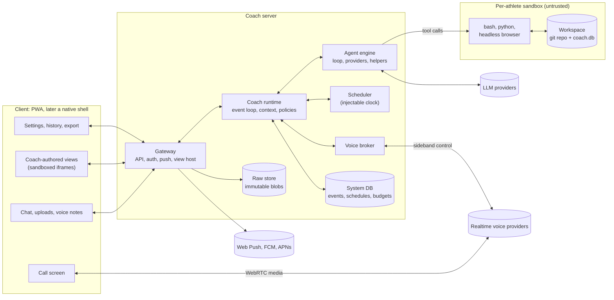
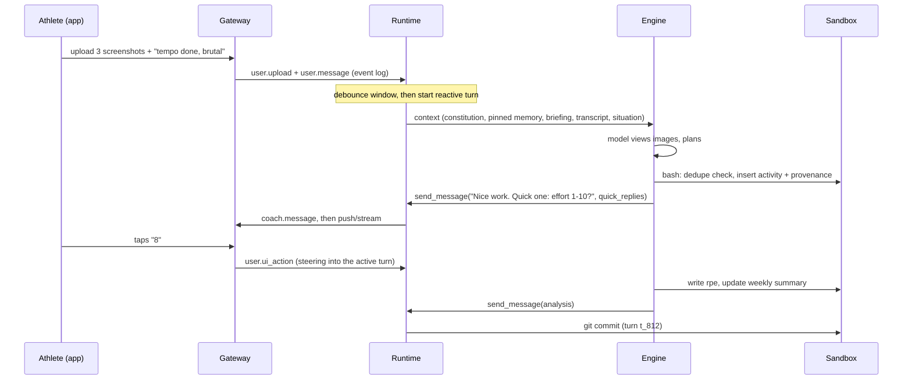
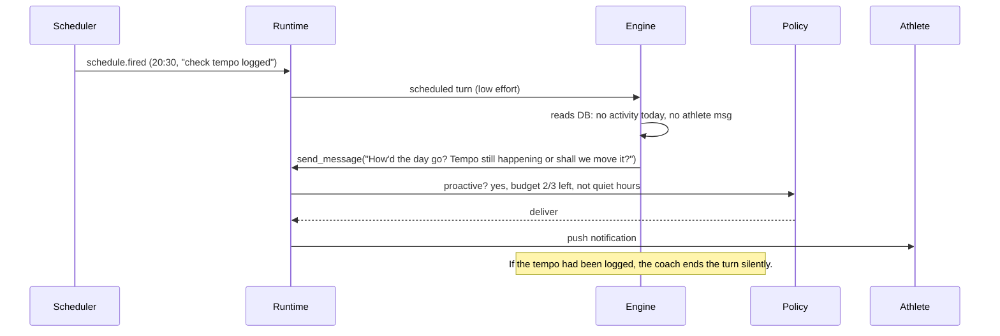

# OpenCoach: an AI-native running coach harness

**Product and technical specification, v0.1 (draft for the build team)**
**Date:** 2026-10-06 · **Status:** Proposed · **Owner:** project founder · **Working title:** "OpenCoach" (placeholder, see §22)

---

## 0. How to read this document

This is the founding spec for the project. It turns a rough brainstorm into decisions the build team can act on. It also says where a decision is still open.

- **Audience:** the (mostly AI) engineering team building the harness, and any human reviewing their work.
- **Requirement language:** **MUST**, **SHOULD** and **MAY** follow RFC 2119. Requirements that need tracking carry IDs such as `[RT-3]`, so tickets, tests and evals can cite them.
- **Main spec vs. appendices:** this file holds the *what* and the *why*. The appendices hold detail you load when you work on that area:

| Appendix | Contents |
|---|---|
| [A: Landscape research](docs/appendix-a-landscape.md) | Models, agent harnesses, voice APIs, generative-UI protocols, sandboxes, health-data access, competitors. Sources and "as of" dates. |
| [B: Constitution draft](docs/appendix-b-constitution.md) | The first version of the harness-owned system prompt for the coach. |
| [C: Contracts](docs/appendix-c-contracts.md) | Event types, tool contracts, the view bridge API, view manifests and the gateway HTTP/WS API. |
| [D: Seed workspace](docs/appendix-d-seed-workspace.md) | The day-zero workspace: file tree, starter files, starter DB schema, skill library and helper profiles. |
| [E: Evaluation plan](docs/appendix-e-evals.md) | The athlete simulator, time machine, graders, scenario suites and CI gates. |

**One-sentence summary:** *We build a thin, durable "body" (workspace, clock, senses, hands, face and guardrails). The LLM is the coach's "mind" and makes every coaching decision. The coach owns its notes, its data model and even the app's screens, so the product improves automatically as models improve.*

---

## 1. Vision and thesis

### 1.1 The problem

Running apps such as Samsung Health, Strava and Runna sell "coaching", but what they ship is mostly fixed templates plus single-pass rules: "missed a run → shift the plan", "pace was fast → bump VDOT". Runna itself says its plans are coach-written templates that an algorithm then adapts, not AI-generated (Appendix A §A.8). None of them does what a good remote human coach does:

- They don't hold a continuous relationship that remembers your knee niggle from March, your kid's swim schedule and your tendency to race your easy runs.
- They don't reach out at the right moment ("Did the tempo happen? How did the hamstring feel?").
- They don't reason across messy, partial, subjective evidence: a screenshot, a voice note saying "legs felt dead", no HR data.
- They don't change their own tools. A human coach makes you a new spreadsheet when you need one. An app gives you the screens its product team shipped.

### 1.2 The thesis

Frontier models (Appendix A §A.1) can now run long, tool-using, multi-step agent loops reliably: Claude Sonnet 5.5 and Opus 5.5, GPT-6.1 Sol, DeepSeek V4. Coding harnesses showed that a model with a persistent workspace, a shell and a few general tools does better than a model wired into many narrow features. **We apply that lesson to coaching:**

> The coach is an agent with a persistent workspace (its office), a clock (it can wake itself up), senses (chat, images, files, voice), hands (code, files, web, messaging) and a face (app screens it writes itself). The app is the harness around it. Coaching decisions live in the model and in the workspace it maintains, never in our code.

### 1.3 What "AI-native" means here: the deletion test

Before putting any behavior in harness code, ask:

> **"If the model were twice as capable, would this code become unnecessary or harmful?"**
> If yes, it does not belong in the harness. Put it in the workspace instead (a prompt, a skill, a file or a coach-authored view), where the model can read it, change it or ignore it.

Examples:
- *Training plan generator*: delete. The model plans; skills give it reference knowledge.
- *Fixed onboarding questionnaire*: delete. The model runs the intake conversation; an intake skill suggests topics.
- *Hard-coded "Progress" screen*: delete. It becomes a seed view the coach owns and can rewrite.
- *Quiet hours*: keep. It is a user-facing guarantee. Guarantees live in code (P8).
- *Raw upload immutability*: keep. It protects evidence and lets better future models re-derive data.

### 1.4 Goals and non-goals (v1)

**Goals**
1. A single, continuous, persistent coach relationship per athlete, through chat, images, files, voice notes and (Phase 2) calls.
2. The coach has full agency over its workspace, its data model, its schedule of check-ins and the app's views (calendar, plan, progress and anything else it decides to build).
3. Proactive behavior that a good coach would show, under user-controlled limits.
4. Natural data input: screenshots, exports, voice and conversational check-ins. No integrations required.
5. Model-agnostic and provider-agnostic. The athlete's coach survives a model swap.
6. Open source and self-hostable first, with a hosted multi-tenant mode as a later deployment of the same code.
7. Safe by design: medical red flags, eating-disorder risk, privacy of special-category health data.
8. Measurable quality: a simulation-based eval suite is the executable definition of "good coaching".

**Non-goals for v1** (revisit later): third-party fitness API integrations (Strava/Garmin; see §10.5 for the ToS problem), social features, a human-coach marketplace, watch apps, live in-run audio coaching, nutrition tracking as a product, users under 18, a public skill marketplace, and sports other than running (the architecture stays domain-agnostic; see §19.3).

---

## 2. Design principles

These are binding. A design that breaks one needs an explicit exception in this document.

| # | Principle | What it means in practice |
|---|---|---|
| **P1** | **Mechanism in the harness, policy in the model.** | The harness provides capabilities: files, exec, messaging, scheduling, rendering, delegation. The model decides what to do with them. |
| **P2** | **The workspace *is* the coach.** | Identity, memory, methodology, data and UI live in a portable workspace. Swap the model and the coach continues. Export the workspace and you take your coach with you. |
| **P3** | **Raw is sacred; interpretations are disposable.** | Uploads are stored immutably and forever (unless the athlete deletes them). Everything derived from them carries provenance and can be regenerated by a better model. |
| **P4** | **Every AI write is versioned and reversible.** | The workspace is a git repo, committed after every turn, and the DB is snapshotted. The athlete can undo the coach's UI changes; developers can bisect coach behavior. |
| **P5** | **State is self-describing.** | The coach documents its own file layout and schemas (`AGENTS.md`, `data/schema.md`). A future model reads that documentation instead of relying on code we wrote. |
| **P6** | **Capabilities, not workflows.** | No hard-coded flows such as onboarding, plan building or weekly review. Skills give knowledge and suggested procedures that the model may adapt. |
| **P7** | **Few, general, composable tools.** | Prefer `bash` + files + a few harness primitives over dozens of narrow tools. Narrow tools cap capability and age badly. |
| **P8** | **Guarantees are enforced in code, not prompts.** | Anything the athlete must be able to rely on is enforced by the harness: quiet hours, message budgets, data immutability, sandboxing, cost caps, age gate, export/delete. |
| **P9** | **Chat is the escape hatch that never breaks.** | Whatever the coach does to the UI, chat, settings, undo and export stay harness-owned and always work. |
| **P10** | **Nothing depends on a single vendor without a fallback.** | Every provider-specific feature (compaction, realtime voice, managed sandboxes) sits behind an interface with at least one alternative. |
| **P11** | **Time is an input.** | All time flows through an injectable clock, so the whole system, sandbox included, can be fast-forwarded through weeks of simulated training in evals. |
| **P12** | **Behavior is specified by evals.** | "Good coaching" is defined by the scenario suites in Appendix E. Prompt and harness changes that regress them don't ship. |

### 2.1 Where we deliberately *are* opinionated

Being unopinionated about coaching does not mean being unopinionated about everything. The harness takes firm positions in these areas, and only these:

1. **Safety floor:** the constitution's safety section, red-flag handling and the age gate. The coach cannot edit these (§12).
2. **Athlete sovereignty:** quiet hours, the proactive-message budget, pause mode, export, delete and undo (§5.5, §13).
3. **Integrity of evidence:** raw immutability, provenance conventions and "never invent numbers" (§10).
4. **Security boundaries:** the sandbox, the view isolation, no secrets in the sandbox, egress control (§13).
5. **Cost ceilings:** per-athlete budgets enforced in code (§16).
6. **The shell:** the minimal, non-removable app chrome (§9.1).

---

## 3. Users and the coaching relationship

### 3.1 Personas

| Persona | Description | What they need most |
|---|---|---|
| **Self-coached amateur** (primary; the founder) | Runs 3 to 6 times a week, has a smartwatch (e.g. Galaxy Watch with Samsung Health), targets a half or full marathon, frustrated by generic plans. | Real adaptation, memory, accountability, insight from their own data. |
| **Beginner** | Couch-to-5K, no watch or a cheap one, anxious about injury. | Encouragement, simple language, conservative progression, RPE-based guidance. |
| **Returning from injury** | Has a history (shin splints, Achilles, ITB) and fears re-injury. | Careful load management, pain monitoring, knowing when to refer to a physio. |
| **Time-crunched parent** | Irregular schedule, often misses sessions. | Flexible weekly rescheduling without guilt. |
| **Self-hoster / contributor** | Tinkerer who runs it on a home server, writes skills and views, swaps models. | Clean architecture, docs, extension points, local-model support. |

### 3.2 What a great remote coach does, and the harness primitive that enables it

| Coaching job | Enabled by |
|---|---|
| Intake: goals, history, constraints, preferences | Chat and voice, workspace memory files, intake skill |
| Designs a periodized plan | Model reasoning, plan-design skill, `planner` and `reviewer` helpers, workspace DB |
| Daily prescription, pre-run nudges | Self-scheduled wakes, `send_message`, push notifications |
| Post-run analysis | Screenshot vision, file parsing in the sandbox, analysis helper |
| Asks how it felt when data is missing | Conversational check-ins, quick replies and forms |
| Adapts to illness, travel, missed runs | Reasoning plus workspace edits; the calendar view updates itself |
| Notices patterns over months | Persistent DB, journal, nightly consolidation, history search |
| Injury triage and referral | Constitution red flags, injury skill, escalation norms |
| Race-week prep, race strategy, debrief | Skills, scheduled wakes, calls |
| Builds tools for the athlete | Coach-authored views and the UI kit |
| Phone calls | Voice calls (realtime voice front-end sharing the same workspace) |
| Sends a voice memo | TTS voice-note attachments |

### 3.3 Key journeys

These double as end-to-end acceptance scenarios (Appendix E §E.5).

**J1. Day 0 (onboarding).** The athlete installs the PWA, signs in, accepts the health-data consent and AI disclosure, and confirms they are 18+. In self-host mode they pick a model and paste API keys. The coach greets them; there are no forms. It runs an intake conversation over one or more sessions (text or voice): goals, race dates, history, current weekly volume, injuries, available days, watch and HR availability, preferences, and how they like to be coached (tough love or gentle). It asks for screenshots of the last 2 to 4 weeks, or a Samsung Health export, extracts the data and confirms the uncertain parts. It writes `athlete/profile.md`, builds an initial block, adapts the seed views (Today, Calendar, Plan, Progress), schedules its first check-ins and tells the athlete what to expect ("I'll message you most mornings around 7 with the day's session. Tell me if that's too much.").

**J2. A typical day.** At 07:00 a wake the coach scheduled earlier fires. It reads the situation report, sees today is an easy 8 km, checks yesterday's notes ("calf tight") and sends a short message: *"Easy 8k today. Keep it conversational, and if the calf is still tight, cut it to 6. How's it feeling?"* with quick replies (*Fine / A bit tight / Sore*). After the run the athlete sends three Samsung Health screenshots. The coach extracts distance, time, pace, HR and splits, writes them to the DB with provenance, notices there's no cadence and moves on, asks for RPE with a 1–10 quick reply, writes a short analysis, and updates Today and Progress.

**J3. Missed session.** At 20:30 a conditional wake ("check whether the tempo got logged") finds nothing. The coach checks in once, gently. The athlete says they're sick. The coach reshuffles the week, explains why (no intensity until 48 h symptom-free), and the calendar view reflects it.

**J4. Red flag.** The athlete mentions chest tightness and dizziness during intervals. The harness safety screen flags it (§12.2). The coach follows the red-flag protocol: stop training, seek medical evaluation, emergency services if symptoms are present now. It pauses intensity in the plan and checks in later. It does not diagnose.

**J5. UI request.** *"Can I see my weekly km as a bar chart with my long runs highlighted?"* The coach edits the Progress view with the UI kit, previews it (it receives screenshots), fixes a layout issue, publishes, and replies *"Done. It's on the Progress tab."* If the athlete dislikes it, settings → View history → Revert.

**J6. Model switch.** The athlete (or self-host admin) switches the coach model from Sonnet 5.5 to GPT-6.1 Sol. The change takes effect at the next context epoch (§5.3). The new model reads the same constitution, workspace, memory and briefing. To the athlete it is still the same coach.

**J7. Call.** The athlete taps **Call coach** and talks for 10 minutes about an upcoming race. The voice front-end has a briefing compiled from the workspace and can consult the main coach for heavy questions. After the call the main coach reads the transcript, updates the race plan and sends a recap.

**J8. Race arc.** Taper wakes, a race-week checklist view the coach builds for this race, a race-morning message, a post-race debrief call or chat, a recovery block, and the result recorded in `races`.

---

## 4. System overview

### 4.1 Ownership model: who owns what

This is the most important structural decision in the system. Each kind of state has exactly one owner, and only that owner writes it.

| State | Owner (writer) | Readers | Store | Mutability |
|---|---|---|---|---|
| Constitution, tool docs, UI-kit docs, first-party skills | **Harness** (release) | Coach | `/system` (read-only mount) | Versioned with releases |
| Event log (conversation and everything that happened) | **Harness** | Coach (read and search), athlete (chat) | System DB | Append-only; tombstones for deletion |
| Raw uploads | **Harness** (on the athlete's behalf) | Coach | Blob store, `/raw` (read-only mount) | Immutable |
| Schedules, budgets, settings, consents, devices | **Harness** (coach writes schedules via a tool) | Coach (via the situation report and tools) | System DB | Mutable via API or tools |
| Memory, notes, plans, data, schemas, views, coach skills, helper profiles | **Coach** | Athlete (via views), harness (to serve views) | Workspace (git repo, `coach.db`) | Mutable, versioned |
| Profile facts the athlete edits directly, and direct UI writes | **Athlete** (through declared view writes) | Coach | Workspace (declared tables) | Mutable, logged as events |

### 4.2 Architecture



**Trust split** (borrowed from Claude Managed Agents' harness/sandbox split): the **agent loop runs in the trusted runtime**, which holds API keys, policies and the event log. **Tool execution runs in the untrusted sandbox**, which holds only the workspace and has no secrets and no general network. This one decision blocks most exfiltration and prompt-injection damage paths (§13).

### 4.3 Components

| Component | Responsibility | Key interfaces |
|---|---|---|
| **Gateway** | HTTP and WebSocket API for clients; auth; upload intake into the blob store; push delivery; serving views on an isolated origin; ICS feed; export and delete jobs | `PushProvider`, `BlobStore`, `AuthProvider` |
| **Coach runtime** | Per-athlete serialized event loop; turn lifecycle; context assembly; policy guards (quiet hours, budgets, reply requirement); commits and snapshots | `Store`, `Clock`, `PolicySet` |
| **Agent engine** | Model loop, tool routing, helper agents, compaction, provider adapters, fallbacks, cost metering | `ModelProvider`, `AgentLoop` |
| **Sandbox provider** | Lifecycle of the per-athlete execution environment with the workspace mounted | `SandboxProvider` (docker, local process, Modal, Daytona, E2B, Cloudflare and others) |
| **Scheduler** | Durable timers (one-shot and RRULE, timezone-aware); heartbeat; fires events into the runtime | `Clock`, `Store` |
| **Voice broker** | Creates realtime sessions (ephemeral tokens), holds the sideband control channel, compiles call briefings, routes voice-tool calls, persists transcripts | `VoiceProvider` |
| **UI publish service** | Validates, renders, screenshots and atomically publishes coach-authored views | Headless Chromium (Playwright) in the sandbox |
| **Clients** | Mobile-first PWA (Phase 1), then a native shell (Phase 2) | Gateway API, view bridge |

### 4.4 Deployment modes

All three modes run the same codebase with different implementations of the §4.3 interfaces.

| Mode | Target | Stores | Sandbox | Notes |
|---|---|---|---|---|
| **Self-host, single athlete** (Phase 1 primary) | Home server, NAS, VPS, laptop | SQLite plus local filesystem | One long-lived Docker container per athlete (gVisor recommended) | `docker compose up`; bring your own API keys; reach it from the phone over Tailscale or Cloudflare Tunnel; **never** exposed without auth |
| **Self-host, small group** (Phase 2) | Family or club | SQLite or Postgres | One container per athlete | Admin UI for inviting athletes |
| **Hosted multi-tenant** (Phase 3) | Public service | Postgres, S3-compatible store | On-demand sandboxes that hibernate between turns (Modal, Daytona or E2B class) | Per-athlete ordered queues; encryption per tenant; billing |

### 4.5 Technology decisions

| Area | Decision | Rationale |
|---|---|---|
| Server language | **TypeScript (Node ≥ 22 or Bun)** | One language across gateway, runtime, UI kit and client; strong WebSocket and WebRTC ecosystem; large OSS contributor pool; most modern agent tooling has first-class TS SDKs. |
| Agent loop | **Our own thin loop** (a few hundred lines) on a **provider-abstraction library**. Default is the **Vercel AI SDK**; **pi-ai** (from pi-mono, as used by OpenClaw) is the alternative. Spike S1 (§5.8) makes the final call. | We need control of turn boundaries, steering injection, context layout and caching, which coding harnesses don't expose. See §5.8. |
| Schemas and protocol | Zod schemas in `packages/protocol`, compiled to JSON Schema and TS types | One source of truth for events, tools and API. |
| System DB | SQLite (WAL, FTS5) self-host; Postgres hosted | Same as above, behind `Store`. |
| Workspace data | Git (text files) plus SQLite `coach.db` | Agents are fluent with both, and both are portable. |
| Client | React PWA (Vite), then a **Capacitor** native shell in Phase 2 | Coach views are web tech anyway; Capacitor keeps one codebase and adds Health Connect, HealthKit, reliable push and background audio. |
| Sandbox image | Debian slim with python3 (pandas, numpy, scipy, matplotlib, fitdecode, gpxpy, duckdb, pillow), sqlite3, node, git, ffmpeg, Playwright + Chromium | Covers data parsing, analysis, charts, and building and testing views. |
| Voice | Provider realtime APIs over WebRTC with a server sideband (OpenAI Realtime, Gemini Live); cascaded fallback through Pipecat or LiveKit Agents (§11) | Latency plus the same-mind design. |
| Observability | OpenTelemetry (GenAI semantic conventions); self-host uses a local viewer, hosted uses any OTLP backend | Standard, vendor-neutral. |

---

## 5. The coach runtime (the "mind loop")

### 5.1 Events

Everything that happens is an **event** appended to the athlete's durable event log. The runtime consumes events and runs **turns**. Full schemas are in Appendix C §C.1.

Inbound events:
- `user.message`, `user.upload`, `user.voice_note`, `user.ui_action`, `user.ui_write`, `user.reaction`, `user.read`, `user.settings_changed`, `user.message_deleted`, `device.context`
- `call.started`, `call.ended`
- `schedule.fired`, `system.heartbeat`, `system.consolidate`, `task.completed`, `task.failed`, `ui.error`, `workspace.external_change`, `harness.upgraded`, `data.synced` (Phase 2)

Outbound and trace events: `coach.message`, `coach.ui_published`, `coach.schedule_changed`, `coach.turn` (summary, cost, model), `harness.notice` (budget, held for quiet hours, delivery failed).

### 5.2 Turns

**Trigger classes**

| Class | Triggers | Reply expected? | Default tier and effort |
|---|---|---|---|
| **Reactive** | `user.message`, `user.upload`, `user.voice_note`, `user.ui_action` with `wake: true` | **Yes**: at least one `send_message` or an explicit `no_reply` | coach / medium |
| **Scheduled** | `schedule.fired`, `system.heartbeat` | No; silence is a valid outcome | coach / low |
| **Follow-up** | `task.completed`, `task.failed`, `call.ended`, `ui.error`, `harness.upgraded`, `workspace.external_change` | Depends on the event | coach / medium |
| **Consolidation** | Nightly (§5.3.5) | No messages allowed | coach / medium, via batch API where available |

**Lifecycle requirements**

- `[RT-1]` The runtime MUST run turns single-flight per athlete. At most one active main-coach turn per athlete at any time. Helper agents may run concurrently (§5.6).
- `[RT-2]` **Batching:** reactive events MUST be collected in a short debounce window before a turn starts, so three screenshots plus a caption become one turn. Defaults: 2.5 s idle, 8 s maximum.
- `[RT-3]` **Steering:** athlete events that arrive *during* an active turn MUST be injected at the next tool-call boundary as an athlete message ("while you were working, the athlete said …"), not queued behind the turn. Non-athlete events queue for the next turn.
- `[RT-4]` **Reply guarantee:** if a reactive turn ends without a `send_message` or `no_reply`, the runtime MUST re-prompt the model once. If that also fails, it MUST deliver a harness-authored, clearly labeled fallback message ("Your coach couldn't respond just now; it will follow up.") and schedule a retry.
- `[RT-5]` **Limits:** each turn has a maximum step count (default 60), a maximum wall time (reactive 5 min, others 20 min) and a token or cost budget (§16). When it nears a limit, the situation report tells the model so it can wrap up.
- `[RT-6]` **Idempotency:** side-effecting tools (`send_message`, `schedule`, `publish_ui`, writes) MUST be keyed by `(turn_id, call_id)`, so a turn retried after a provider failure doesn't double-send.
- `[RT-7]` **Provider failure:** retry with backoff, then the configured fallback model chain (§5.7). Every fallback is recorded in the turn trace.
- `[RT-8]` **Commit:** at turn end the runtime MUST git-commit workspace changes. The message includes turn id, trigger and model. If `coach.db` changed, the runtime takes a DB snapshot. These commits feed the athlete-visible "Coach's changes" feed (§6.3).
- `[RT-9]` **Progress visibility:** while a turn runs, the gateway streams presence and progress to the client ("Coach is looking at your splits…"). This comes from the model's progress notes where the provider supports them (e.g. Claude's `display: "updates"`) or from a mapping of tool names to friendly labels.



### 5.3 Context assembly and memory

The athlete sees **one infinite conversation**. Context windows are finite, and good coaching needs the *right* context, not all of it. The runtime assembles each turn's context in layers ordered for prompt-cache efficiency: stable content first, volatile content last.

| Layer | Content | Owner | Changes | Default budget |
|---|---|---|---|---|
| L0 | **Constitution** (Appendix B) | Harness | Per release | ~4–6k tokens |
| L1 | **Tool schemas** | Harness | Per release | ~3–5k |
| L2 | **Skills index** (name and description only; bodies load on demand) | Harness and coach | Per epoch | ~1–2k |
| L3 | **Pinned memory**: files the coach lists in `AGENTS.md` front-matter (e.g. persona, athlete profile, current week) | Coach | Per epoch | **≤ 12k hard cap** |
| L4 | **Epoch briefing**: the coach's own summary of recent days, open threads and plan state, written by consolidation | Coach | Per epoch | ≤ 6k |
| L5 | **Epoch transcript**: this epoch's events, rendered, append-only | Harness | Grows | Compaction trigger ~80k |
| L6 | **Situation report**: now, trigger, budgets, pending tasks, delivery state, limits | Harness | Every turn | ~0.5–1.5k |

**5.3.1 Epochs.** A context epoch is a fresh context window that starts from L0–L4.
- `[CTX-1]` A new epoch MUST start at the first event after a local "day boundary" (default 04:00 athlete time). It MUST also start on a model change and on explicit request. Within an epoch, history is append-only, which keeps the prompt cache valid and satisfies providers that bind reasoning blocks to an unedited history (Appendix A §A.1).
- `[CTX-2]` If L5 exceeds the compaction trigger mid-epoch, the runtime MUST compact. It uses provider-native compaction when available and well-behaved (e.g. Anthropic's compaction beta). Otherwise it uses harness compaction: the coach writes an "epoch so far" summary, which replaces the older transcript.
- Continuity across epochs comes from L3/L4 plus **retrieval**. The coach can grep the read-only rendered transcripts in `/history/YYYY/MM/DD.md` or call `search_history` (FTS over the event log).

**5.3.2 Pinned memory.** The coach chooses what is always in context by listing files in `AGENTS.md` front-matter (Appendix D). `[CTX-3]` The harness MUST enforce the L3 cap. When the cap is exceeded it loads files in list order until the cap, then reports the truncation in the situation report ("pinned context 14.2k > 12k cap; condense `athlete/profile.md`").

**5.3.3 Memory writing is the coach's job.** The harness does not extract "memories" with a hidden pipeline. The coach decides what to record, and where. This is P1 and P5. To counter forgetting, the runtime **nudges**, an idea borrowed from Hermes Agent's agent-curated memory with periodic nudges. After a call, after an onboarding-like conversation, or after N turns without any write to pinned files, the situation report carries a line such as *"Consider whether anything from this conversation belongs in your notes."*

**5.3.4 The situation report** (L6) is the model's ground truth for time and state. Example:

```
<situation>
now: 2026-10-07T06:58:12+02:00 (Tuesday) · athlete tz: Europe/Amsterdam
trigger: schedule.fired sch_123 "Tue morning prescription", set by you 2026-10-05
last athlete message: 14h ago · your unread messages: 0
proactive messages left today: 3/3 · quiet hours 22:00–07:00 (ends in 2 min; sends are held until then)
pending: task tsk_9 (planner, running 3m) · 2 ui actions since your last turn
pinned context: 9.8k/12k · epoch: 2026-10-07 #1 · model: claude-sonnet-5-5 (coach tier)
budget: 41% of monthly used (day 7 of 31) · this turn: max 60 steps
</situation>
```

Where the provider supports it, the report goes in as a mid-conversation system message, e.g. Anthropic's mid-conversation `system` role, which keeps the cached prefix intact. Otherwise it goes in as a clearly delimited harness note.

**5.3.5 Nightly consolidation ("dreaming").** A harness-scheduled turn runs after the athlete's day ends (default 03:00 local). The coach reviews the day's transcript and workspace changes, then:
- updates pinned memory
- resolves contradictions, favouring the newest information but keeping history in the journal
- appends to `journal/`
- writes the next epoch's briefing (L4)
- checks data integrity (unconfirmed extractions, duplicates)
- may refine its own skills

This mirrors Claude Managed Agents' "dreaming" and Hermes' consolidation, done in our own loop. It is latency-insensitive, so it SHOULD run through a provider batch API (about 50% cheaper) where available. `[CTX-4]` Consolidation turns MUST NOT message the athlete.

### 5.4 Talking to the athlete

- `[MSG-1]` **The only channel to the athlete is the `send_message` tool**, in every turn type. The model's final free text is a private "turn note", logged in traces and never delivered. One explicit channel makes proactivity, multi-message replies, attachments and evals unambiguous.
- `[MSG-2]` `send_message` supports: markdown text; attachments (raw blobs, workspace files, images and charts the coach rendered, PDFs); **micro-UI** (quick replies, simple forms; §9.3); a voice-note flag (rendered by TTS); a notification level (`none | silent | normal`); and `reply_to`.
- `[MSG-3]` Text streams to the client as the tool input is generated (eager or fine-grained tool-input streaming where the provider supports it), so chat feels live.
- `[MSG-4]` Delivery policy is applied *after* the coach sends (§5.5). Quiet hours apply to proactive messages; athlete-requested replies, first contact and calls can be delivered immediately. If a message is held or rejected, the tool result says so, e.g. `"held until 07:00 (quiet hours)"` or `"rejected: proactive budget exhausted"`, and the coach can adapt. A released held message is a new event with the same stable `payload.messageId`, allowing clients to deduplicate it. The release rechecks the athlete's current quiet hours, pause, budgets and minimum gap.
- `[MSG-5]` The coach SHOULD acknowledge long work fast ("Give me ~10 minutes to build this properly") and then deliver. Background tasks (§5.6) make this natural.
- Message style is governed by the constitution, not code: short, warm, specific, texting-style, several messages allowed.

### 5.5 Proactivity

Three mechanisms let the coach act unprompted:

1. **Coach-scheduled wakes.** The `schedule` tool supports one-shot (`at`) and recurring (`rrule` in the athlete's timezone) wakes. Each carries a `purpose`, a note to its future self. *Conditions are evaluated by the model at wake time*, not by a rule engine. Example: "At 20:30, check if today's tempo was logged; if not and no message from athlete today, check in gently." This follows P1: no DSL to maintain, and a smarter model makes better judgment calls.
2. **Heartbeat.** A harness safety net, a pattern borrowed from OpenClaw's `HEARTBEAT.md`. Once a day, at a time the coach sets (default 07:30), the runtime wakes the coach with its `HEARTBEAT.md` checklist. This guarantees no athlete is forgotten because the coach failed to schedule anything. OpenClaw's default is every 30 minutes; daily is enough for coaching and costs much less.
3. **Event-driven follow-ups**: task completion, call end, view errors, harness upgrades.

**Policies (harness-enforced, athlete-configurable)**

| Policy | Default | Range | Enforcement |
|---|---|---|---|
| Quiet hours | 22:00–07:00 local | Any window | Messages are held and delivered at the window's end. Wakes still fire, because thinking is allowed and talking is held. |
| Proactive message budget | 3 per day, 12 per week | 0–10 per day | A `send_message` from a non-reactive turn beyond the budget is rejected with an explanatory tool error. Replies to the athlete and results of tasks the athlete requested don't count. |
| Minimum gap between proactive messages | 2 h | 0–12 h | Held |
| Pause ("vacation mode") | Off | Until a date | Suppresses wakes except those the coach flagged `during_pause: true`, such as the return date. |
| Unread pile-up | Coach is told the unread count | — | Situation report |

**Norms (constitution, evaluated):** reach out when a good human coach would; silence is fine; no guilt-tripping, streak pressure, or engagement-bait. These are tested in Appendix E §E.4 ("annoyance" and "ghosting" suites).



### 5.6 Helper agents (subagents) and background tasks

- `[SUB-1]` The `spawn_agent` tool starts a helper with: a task, an optional **profile** (`workspace/agents/*.md`, front-matter: model tier, tools allowlist, effort, write scope), explicit input paths, and `background: bool`.
- `[SUB-2]` **One voice:** helpers MUST NOT message the athlete or create schedules. The head coach is the single point of contact, like a head coach with assistants.
- `[SUB-3]` Helpers get a **scoped context**: the task, their profile, the constitution's helper section, and read access to the workspace. Write access is only within their declared write scope. They don't see the conversation unless the coach passes excerpts.
  Helpers work in separate Git worktrees. The harness copies only permitted regular files back into the parent's workspace; nested scopes intersect ancestor grants. A foreground helper receives a consistent copy of `coach.db`, merged back only if the database is explicitly within scope. Git metadata stays read-only in tool execution.
- `[SUB-4]` Limits: depth ≤ 2, ≤ 4 concurrent per athlete, a per-helper budget.
- `[SUB-5]` A background helper returns a `task_id` immediately. Completion emits `task.completed`, which triggers a follow-up turn. If the task traces back to an athlete request, the coach's resulting message counts as a reply (not proactive).
- **Seed profiles** (Appendix D), all coach-editable:

| Profile | Purpose | Default tier |
|---|---|---|
| `extractor` | Pull structured data from screenshots and files, with confidence values | fast (vision) |
| `analyst` | Crunch data, plot charts, compute training load | coach |
| `planner` | Draft a training block under stated constraints | deep |
| `reviewer` | Independent sanity and safety check of plan changes ("second coach") | coach or a *different* provider |
| `researcher` | Web research: race courses, weather, literature, with citations | fast |
| `ui-builder` | Build and test views | coach |

The coach can write new profiles. Using a different model family for `reviewer` is a cheap way to get decorrelated errors.

### 5.7 Model layer

**Tiers, not models.** The runtime addresses models by tier. Deployment config maps tiers to concrete models. The IDs below are examples; verify them at build time (Appendix A §A.1).

```yaml
# config/models.yaml (illustrative)
tiers:
  coach:      { provider: anthropic, model: claude-sonnet-5-5, effort: medium }
  deep:       { provider: openai,    model: gpt-6.1-sol,       effort: high }
  fast:       { provider: openai,    model: gpt-6-luna }
  voice:      { provider: openai,    model: gpt-realtime-2.1 }
  transcribe: { provider: openai,    model: gpt-realtime-whisper }   # or local Whisper/Parakeet
  tts:        { provider: elevenlabs }                               # or provider/local TTS
fallbacks:
  coach: [ { provider: openai, model: gpt-6.1-sol }, { provider: deepseek, model: deepseek-v4-pro } ]
```

- `[MOD-1]` **Capability routing.** Each tier declares required capabilities: tool calling, image input, ≥ 200k context, streaming tool input. If the coach model lacks vision (some DeepSeek variants are text-only), the runtime MUST transparently route image understanding through a vision-capable `extractor` helper and tell the coach it did so.
- `[MOD-2]` **Conformance gate.** A model can't be assigned to the `coach` tier until it passes the *model conformance suite* (Appendix E §E.6), a ~30-minute run of tool-use reliability, `send_message` discipline, schedule semantics, image reading and safety basics. Results are published in a public compatibility matrix.
- `[MOD-3]` **Switching.** A model change takes effect at the next epoch, or forces a new one. The new epoch's situation report names the model so the coach knows its own capabilities. No reasoning or thinking blocks cross model boundaries (provider constraint; Appendix A §A.1).
- `[MOD-4]` **Provider features behind flags.** Prompt caching, native compaction, mid-conversation system messages, batch, effort and reasoning controls, progress notes, and refusal fallbacks are used where present and emulated or skipped where absent. Nothing in coaching behavior may *depend* on one provider's feature (P10).
- `[MOD-5]` **Local models.** Any OpenAI-compatible endpoint (vLLM, Ollama, LM Studio) can be configured for any tier. Coach-tier quality must still pass conformance.

### 5.8 Agent engine: build vs. adopt

The brainstorm asked whether to integrate a ready-made open-source harness or build our own inspired by them. Appendix A §A.2 has the full comparison. Summary:

| Candidate | Fit | Blocking issue for *our* core |
|---|---|---|
| **Claude Managed Agents** (hosted loop + sandbox, scheduled deployments, memory and "dreaming", multi-agent) | Functionally the closest | Claude-only (breaks P10); vendor-hosted (conflicts with self-host OSS); beta; not eligible for zero data retention. Good as an *optional engine adapter* for a hosted Claude deployment. |
| **Claude Agent SDK** | Strong harness | Claude-only; TS SDK governed by Anthropic Commercial Terms, so not cleanly OSS. |
| **OpenAI Agents SDK** (sandbox harness, Apr 2026) | Strong harness, MIT | OpenAI-first; multi-provider is second-class. |
| **Codex app-server** (Apache-2.0, JSON-RPC) | Embeddable | Coding-specialized; Rust; OpenAI-centric. |
| **OpenCode** (`opencode serve`, MIT, 75+ providers, OpenAPI SDK) | Embeddable server, multi-provider | Coding assumptions throughout; no built-in sandbox; multi-session model doesn't match one continuous relationship; we'd fight it for turn and context control. |
| **Hermes Agent** (Nous, MIT, Python): memory, skills, cron, gateways, 7 terminal backends | Very close to a *personal* coach | Single-user personal-assistant design, large general-purpose surface, Python; no app UI, view publishing, or same-mind voice. |
| **OpenClaw** (MIT, TS, on pi runtime): gateway, heartbeat, channels, Canvas/A2UI | Closest to "persistent agent that messages you" | Security record (138+ CVEs, malicious skill marketplace, many exposed instances); heavy; general-purpose. |
| **pi-mono** (`pi-ai`, `pi-agent-core`; MIT, TS) | Minimal, embeddable runtime library | Deliberately omits subagents and permissions, which is fine because we write those. |

**Decision:** we **build a thin coach runtime of our own** (the parts in §5.1–5.7) on top of a **provider-abstraction library**, and **adopt patterns, not codebases**, from the systems above. Reasoning:

1. What makes this product different is the proactive event loop, the single continuous relationship with epochs, coach-authored views with a publish pipeline, same-mind voice, the safety and policy guarantees, and the eval time machine. **No existing harness provides these.** Each would need to be wedged into a coding- or assistant-shaped host.
2. What harnesses *do* provide (a tool loop, file tools, bash, compaction, provider adapters) is small, well understood, and mostly available as libraries.
3. Harness projects churn weekly. Our engine sits behind `AgentLoop` and `ModelProvider` interfaces, so we can add adapters for OpenCode, Managed Agents or Codex later without touching the runtime (P10).

**Spike S1 (week 1 of Phase 1, time-boxed to 3 days):** implement the `AgentLoop` contract twice, on the Vercel AI SDK and on pi-ai. Pass if all of the following hold:
- (a) Anthropic and OpenAI tool loops have parity, including image input and streaming tool input.
- (b) Prompt-cache hit rate is ≥ 80% on L0–L4 across a 10-turn epoch.
- (c) Steering injection works at tool boundaries.
- (d) Provider-native compaction and reasoning-block rules are respected.
- (e) DeepSeek works through its OpenAI-compatible API.

Pick the library that passes with less glue code.

**Phase 0 uses an existing harness on purpose (§20).** We validate the *brain* (constitution, seed workspace, skills, cadence) on Hermes Agent with Telegram for 2–3 weeks of real training before building the body. The workspace and skills use open formats (`AGENTS.md`, Agent Skills `SKILL.md`), so they carry over unchanged.

---

## 6. The workspace

### 6.1 Layout

The seed layout is below. The coach may reorganize it, but it MUST keep `AGENTS.md` accurate. Full starter contents are in Appendix D.

```
/workspace                      # coach-owned; git repo
  AGENTS.md                     # coach's operating manual + map of this workspace (+ pinned list)
  HEARTBEAT.md                  # what to check on the daily heartbeat
  coach/persona.md              # name, voice, coaching philosophy (co-authored with athlete)
  athlete/profile.md            # core facts: goals, constraints, current phase (pinned)
  athlete/health.md             # injuries, conditions, clearances (sensitive)
  athlete/preferences.md        # communication + scheduling preferences
  athlete-input/                # files views may write directly (declared in view.json)
  plan/current.md               # the current block in prose: intent, phases, key sessions
  plan/current-week.md          # next 7 days in prose (pinned)
  journal/YYYY/MM/DD.md         # coach's daily notes
  briefing.md                   # next-epoch briefing (written by consolidation)
  data/coach.db                 # SQLite; coach-owned schema
  data/schema.md                # human/AI-readable schema documentation
  data/migrations/              # schema migrations the coach has applied
  ui/app.json                   # nav + home + theme
  ui/views/<id>/                # view.json + index.html + assets
  ui/components/                # coach's reusable web components
  skills/                       # coach-authored skills (Agent Skills format)
  agents/                       # helper profiles
  exports/                      # files served to athlete (e.g., calendar.ics)
  feedback-to-harness.md        # coach's notes to the developers (opt-in telemetry)
/raw      (read-only)           # immutable uploads by sha256 + metadata sidecars
/history  (read-only)           # rendered transcripts by day
/system   (read-only)           # constitution, tool docs, UI-kit docs, first-party skills, coach changelog
```

### 6.2 Self-description and schema ownership

- `[WS-1]` The coach owns `coach.db`'s schema. The seed ships a starter schema (Appendix D §D.4) that the seed views use. When the coach changes the schema it MUST write a migration file and update `data/schema.md`. Views that depend on changed tables are the coach's responsibility, and the publish pipeline re-validates all views after a migration (§9.6).
- `[WS-2]` `AGENTS.md` is the entry point for any model, now or future, to understand the workspace. The seed gives it a section structure (map, conventions, pinned list, open threads). The coach keeps it current.

### 6.3 Versioning, snapshots, undo

- `[WS-3]` Every turn's changes are committed (`[RT-8]`). `coach.db` gets an online backup snapshot per modifying turn, keeping the last 50 plus daily ones for 90 days. A nightly SQL text dump is committed so data changes are diffable.
- `[WS-4]` **Coach's changes feed:** the client shows a readable activity feed built from commits and their turn summaries ("Moved Thursday's tempo to Friday", "Updated Progress view"). Trust grows when the athlete can see what changed.
- `[WS-5]` **Undo:** the athlete can revert a view, or "undo the coach's last change", from settings. A revert is itself a commit and emits an event so the coach learns of it.
- `[WS-6]` **External edits:** self-hosters may edit the workspace by hand. The runtime detects foreign commits and emits `workspace.external_change` with the diff stat, so the coach can review.

### 6.4 Raw store and provenance

- `[WS-7]` Uploads are stored content-addressed (sha256), with metadata (mime, size, original filename, upload time, device, related message). By default the coach-visible copy has GPS EXIF stripped (opt-in to keep it).
- `[WS-8]` Seed conventions require derived records to reference their sources (`source`, `source_refs`, `extracted_by`, `confidence`, `confirmed`). The coach can re-derive everything from `/raw` with a newer model. Phase 2 adds a "re-process my history" background task.

### 6.5 Harness upgrades, addressed to the coach

- `[WS-9]` Each release ships `/system/CHANGELOG-for-coach.md`, written *for the model*: new tools, changed UI-kit components, deprecated APIs, and suggested migrations. On upgrade, a `harness.upgraded` event triggers a follow-up turn in which the coach reads it and adapts its workspace, for example migrating views to a new kit version. Views pin a UI-kit major version, and old majors stay served for at least two releases.

---

## 7. Tools (the coach's hands)

Kept deliberately small (P7). Full contracts, parameters and errors are in Appendix C §C.2.

| Tool | Purpose | Runs in | Key guards |
|---|---|---|---|
| `read`, `write`, `edit`, `glob`, `grep` | Workspace file operations; `read` on images returns the image to the model | Sandbox FS | Path jail; read-only mounts; size limits |
| `bash` | Shell (python, sqlite3, node, git…) in the sandbox | Sandbox | No secrets; **no general egress** (package installs via an allowlisted mirror only); timeout; output caps |
| `send_message` | The only channel to the athlete (§5.4) | Runtime | Policy engine; idempotency |
| `no_reply` | Explicitly end a reactive turn without replying, with a reason | Runtime | Reactive turns only |
| `schedule`, `list_schedules`, `cancel_schedule`, `set_heartbeat` | Self-wakes and the heartbeat time (§5.5) | Runtime | ≤ 50 active; minimum interval 15 min; timezone-aware RRULE |
| `spawn_agent`, `task_status`, `cancel_task` | Helpers and background tasks (§5.6) | Runtime | Depth, concurrency and budget limits |
| `preview_ui`, `publish_ui`, `rollback_ui` | Validate, screenshot, publish and revert views (§9.6) | Runtime + sandbox Chromium | Validation gates |
| `web_search`, `web_fetch` | Research: weather, races, literature | Runtime (proxied) | Rate limits; results marked untrusted; logged |
| `search_history` | Full-text search over the event log, with date and type filters | Runtime | Returns excerpts with event ids |
| MCP tools (Phase 2) | Athlete- or admin-connected MCP servers | Runtime | Per-server allowlist; untrusted output |

Voice sessions get a separate, smaller toolset (§11.2).

---

## 8. Skills

- `[SK-1]` Skills use the **Agent Skills** open format (`SKILL.md` with name and description front-matter, plus optional scripts and references), loaded with progressive disclosure: only the index sits in context (L2); bodies load when used. The format is supported by Claude, Codex, Gemini CLI, Hermes, OpenClaw and others (Appendix A §A.4), so skills port across harnesses, including the Phase 0 testbed.
- **First-party skills** (`/system/skills`, read-only, versioned) are *knowledge and suggested procedures*, not workflows. The coach may ignore or override them, except for anything that restates the safety floor. Seed library (details in Appendix D §D.6):
  - `intake`, `screenshot-extraction`, `file-import` (FIT/GPX/TCX/CSV/ZIP exports)
  - `training-load` (sRPE, TRIMP, ACWR *with caveats*)
  - `zones-and-paces` (HR, pace, RPE, talk test, VDOT-style equivalences)
  - `plan-design` (periodization, progression, sample structures 5K to marathon, evidence notes)
  - `injury-and-pain` (red flags, pain-monitoring model, return-to-run, referral)
  - `illness-return`, `race-prep`, `environment` (heat, cold, altitude, air quality)
  - `strength-mobility`, `fueling-basics` (with RED-S and ED cautions)
  - `ui-kit` (how to build good views), `calendar-export` (ICS), `data-hygiene` (dedupe, units, timezones)
- `[SK-2]` **Coach-authored skills** live in `workspace/skills`. The coach is encouraged to turn repeated procedures into skills, as Hermes does with autonomous skill creation, e.g. "how this athlete's Samsung Health screenshots are laid out".
- `[SK-3]` **No third-party skill installation in v1.** The ClawHub audits found 13% of public skills with critical security flaws (Appendix A §A.2). Phase 3 may add a curated registry with review, signing and an install-time diff shown to the athlete.

---

## 9. The UI system: coach-authored surfaces

The brainstorm's hardest requirement is that calendar, plans, progress and everything else should be controlled and rewritable by the AI. Here is how that works without the app turning into a fragile mess.

### 9.1 Shell vs. surfaces

**The shell (harness-owned, always works, P9):**
- Chat thread with composer (text, camera and photos, files, voice-note record), the **Call** button, and the presence and progress indicator
- Navigation frame with slots the coach fills
- **Settings:** account; model and keys (self-host); notifications (quiet hours, budgets, pause); data (export, delete); **view history and revert**; the coach's changes feed; consents
- The safety banner area, which only the harness can write (§12.2)
- Offline indicator and the cached-data notice

**Surfaces (coach-owned):**
1. **Views:** full-screen pages in the nav. The coach decides which views exist, their order, titles, icons and content: Today, Calendar, Plan, Progress, Race, Shoes, or anything else.
2. **Cards:** embeddable view fragments in chat messages (a workout card, a chart) and on the home view.
3. **Micro-UI:** quick replies and simple forms attached to messages and notifications.
4. **Exports:** ICS calendar feed, PDFs, shareable images.

### 9.2 Views: HTML in sandboxed iframes, aligned with MCP Apps

**Options considered:**
- *Declarative component JSON* (A2UI-style: agent sends a component tree; client renders native components). Safe and consistent, but expressiveness is capped by our component catalog. That caps future models, which contradicts the thesis.
- *Arbitrary HTML/JS in a sandbox* (MCP Apps-style; Appendix A §A.5). Maximally expressive, and models are excellent at web code. The risks are security, consistency, breakage and mobile performance.

**Decision:** **views are HTML/CSS/JS in sandboxed iframes**, with a postMessage JSON-RPC bridge modeled on **MCP Apps (SEP-1865)**, plus a first-party **UI kit** that the coach is strongly encouraged to use. **Micro-UI** in messages and notifications uses a small declarative schema (§9.3), because it must render instantly in chat and inside OS notifications, where HTML can't go. Each risk is handled by a specific mechanism:

| Risk | Mitigation |
|---|---|
| Security | `sandbox="allow-scripts"` (no same-origin); isolated origin; CSP `default-src 'none'`, scripts and styles only from the view bundle and the kit; `connect-src 'none'`; data only via the bridge; bridge messages schema-validated |
| Inconsistency | UI kit: design tokens, typography and components (calendar, week strip, workout card, charts, stat tiles, forms, body map for pain location, route map in Phase 2); `ui-kit` skill with design rules; seed views as examples |
| Breakage | Publish pipeline with headless render, error capture, screenshots and atomic swap; last-known-good fallback; runtime errors flow back to the coach as `ui.error` (self-healing) |
| Mobile performance | Render-time and bundle-size budgets checked at publish; kit components are lightweight web components |
| Future portability | The bridge follows MCP Apps conventions, so in Phase 3 coach views can be exposed as MCP Apps (e.g. "show my training calendar inside Claude or ChatGPT") |

### 9.3 Micro-UI (declarative)

Attached to `send_message` (Appendix C §C.3):
- `quick_replies`: up to 6 chips, each with a label and a value
- `form`: fields of type `scale` (e.g. RPE 1–10), `choice`, `multi_choice`, `number` (with unit), `text`, `date`, `time`, `body_map`
- `notification_actions`: up to 3 buttons on the push notification (e.g. *Done ✅ / Skipped / Move it*)

Responses arrive as `user.ui_action` events tied to the message, with `wake: true` by default.

### 9.4 Data access from views

The coach declares in each `view.json` what the view may read and write (Appendix C §C.4):

```json
{
  "id": "calendar", "title": "Calendar", "icon": "calendar",
  "placement": { "nav": 2 }, "entry": "index.html", "kit": "1",
  "reads": ["db:planned_workouts", "db:activities", "file:plan/current.md"],
  "writes": [
    { "db": "planned_workouts", "ops": ["update"], "columns": ["date", "status"] },
    { "db": "checkins", "ops": ["insert"] }
  ],
  "actions": ["workout_moved", "ask_coach"],
  "refresh": "on-change"
}
```

The bridge provides: `coach.db.query(sql, params)` (read-only connection, row cap); `coach.files.read(path)`; `coach.db.write(...)` (declared targets only; becomes a `user.ui_write` event); `coach.act(name, payload, {wake})`; `coach.navigate`; `coach.openChat({prefill, ref})`; `coach.subscribe(targets, cb)`; `coach.env` (theme, locale, units, timezone, `now()`); `coach.toast`; and error and log reporting.

- `[UI-1]` **Direct writes without an LLM turn.** Simple athlete inputs from views ("mark done", drag a workout to Friday) MUST be writable directly to declared targets. They're instant, free and work offline (queued). Each emits `user.ui_write`. The coach sees it in its next turn, or immediately if the view also fires `act(..., {wake:true})`. This keeps the UI responsive and cheap while the coach stays informed.

### 9.5 App manifest

`ui/app.json` defines the nav order, the home view and the theme accent. The shell renders the nav from it. `[UI-2]` The shell MUST keep chat reachable whatever `app.json` says.

### 9.6 Publish pipeline

`preview_ui` and `publish_ui` run these steps:
1. **Static checks:** manifest schema, referenced files exist, no external URLs, kit version supported, declared reads and writes valid against the current DB schema.
2. **Headless render** (Chromium in the sandbox) at 390×844 and 768×1024, light and dark, against **(a)** the athlete's current data and **(b)** an empty-state fixture.
3. **Runtime checks:** zero uncaught errors and CSP violations; first render < 1.5 s on 4× CPU throttling; bundle ≤ 500 KB excluding the kit; axe-core: no *critical* accessibility violations (serious ones are warnings in v1).
4. **Screenshots returned to the coach** for visual self-review. The coach is expected to look at them.
5. **Atomic publish:** git tag `ui/<id>@<n>`. The client receives `coach.ui_published` and shows a subtle "Updated by your coach" marker.
6. **Last-known-good:** if a published view throws on a device, the client falls back to the previous version and reports `ui.error`, which triggers a follow-up turn to fix it.

- `[UI-3]` After any `coach.db` migration, all views that read the changed tables MUST be re-validated. Failures are reported to the coach in the same turn.

### 9.7 Seed views

Day zero must not be blank, and examples teach better than docs. The seed ships **Today**, **Calendar** (week and month, planned vs. done), **Plan** (block overview with phases and key sessions) and **Progress** (weekly volume, long-run trend, easy-run HR drift if data exists). They're written with the UI kit against the starter schema. **The coach owns them from day zero.**

### 9.8 Calendar export

The coach writes `exports/calendar.ics` (the `calendar-export` skill shows how). The gateway serves it at a secret, revocable subscribe URL that Google, Apple and Outlook calendars can poll. No calendar API integration is needed.

### 9.9 Offline

The PWA service worker caches the shell, published views and a read-only snapshot of the data those views last read. Direct writes queue offline. Messages queue offline and send on reconnect. Runners are often in poor-signal places, so this matters.

---

## 10. Data ingestion

### 10.1 Screenshots (the primary v1 path)

The athlete sends one or more screenshots, from Samsung Health or any app, with an optional caption. The coach:
1. Reads the images itself if its model has vision, or delegates to the `extractor` helper (`[MOD-1]`).
2. Extracts only visible fields, with units. It MUST NOT infer invisible values.
3. Dedupes against existing activities (date, time, distance, duration) and checks image hashes for exact re-uploads.
4. Writes records with provenance.
5. Confirms with the athlete *only* fields that are uncertain and matter for decisions.
6. Asks for the missing subjective layer (RPE, how it felt, pain).

Multi-screen workouts (summary, HR graph, splits) are merged. Graphs are read approximately and flagged as such.

`[ING-1]` A **labeled screenshot corpus** (≥ 200 images: Samsung Health, Garmin Connect, Apple Fitness, Strava, Coros, Polar, NRC; light and dark; km and mi; several languages) is a Phase 0 deliverable. It is used for extraction evals and has a zero-tolerance metric for hallucinated fields (Appendix E §E.4).

### 10.2 Files

FIT, GPX, TCX, CSV and ZIP exports (including Samsung Health's "Download personal data" CSV/JSON export, and Garmin or Strava *bulk exports the athlete downloads themselves*) are parsed by the coach in the sandbox with the pre-installed libraries. No integration code is needed, which is the AI-native payoff. The `file-import` skill documents known formats and pitfalls: timezone offsets in Samsung exports, FIT developer fields, duplicate sessions across sources.

### 10.3 Subjective and conversational data

RPE (session RPE, 1–10), sleep, soreness, mood and stress, pain (location by body map plus 0–10 severity plus behavior), illness, life load, and optionally the menstrual cycle (explicit opt-in; sensitive). These are collected **conversationally and through micro-UI, at the coach's discretion.** When there is no HR data, the coach coaches by RPE and talk test.

### 10.4 Voice notes

The athlete holds to record. The transcription tier transcribes, and the event carries both the audio blob and the transcript. The coach may reply with a voice note (TTS). This is asynchronous and cheap, and it is how many athletes already talk to human coaches, so **voice notes ship in the MVP, ahead of calls.**

### 10.5 Future data sources, and the ToS minefield

- **On-device OS health stores (Phase 2, preferred):** Android **Health Connect** (Samsung Health syncs into it) and iOS **HealthKit**, read on-device by the native shell and uploaded as raw sync batches into `/raw`, emitting `data.synced`. The data is the athlete's own and flows under their consent.
- **Third-party fitness APIs: legal review required before any integration.** Strava's API policy (effective 2026-06-01) prohibits using Strava data "in connection with the development, training, evaluation, or operation of any AI Application", including as prompt context. Strava's sanctioned route is its own MCP server (Appendix A §A.7). Other platforms are moving the same way. Our default stance is that **athlete-initiated exports and on-device OS stores are fine; server-to-server fitness APIs are off by default**, and a user-connected MCP server (Phase 2) is used only where that platform's terms allow it.

---

## 11. Voice

### 11.1 Voice notes (MVP)

See §10.4.

### 11.2 Calls (Phase 2): a realtime voice front-end with the same mind

**The problem:** native speech-to-speech models (OpenAI `gpt-realtime-2.1`, Google `gemini-3.1-flash-live`) give a natural ~sub-second conversation, but they are *different models* from the coach brain, with smaller context and weaker long-horizon reasoning. Anthropic still offers no native realtime speech API (Appendix A §A.3). A cascaded pipeline (STT → coach model → TTS) keeps the same model but adds latency.

**Design: "briefed voice, shared mind"**

1. **Briefing.** On *Call*, the runtime compiles a call briefing (≤ 8k tokens) from the workspace: persona, pinned memory, current week and plan state, the last 72 h summary, open threads, any questions the coach left for the next conversation, and the call purpose if known. This becomes the realtime session's instructions. A short coach turn MAY run first to write a fresh briefing, which hides behind ringback.
2. **Voice toolset** (sideband-executed server-side; the client only carries media):
   - `lookup(query)`: grep or SQL over the workspace through the runtime (read-only, fast)
   - `consult_coach(question)`: asynchronous delegation to the main coach model for decisions such as "should we move the long run?"; the voice model talks naturally while it waits (gpt-realtime-2.x "preambles")
   - `note(text)`: append to call notes (facts learned, commitments)
   - `end_call()`
3. **Write-back.** The voice front-end **never writes the plan or memory directly.** On `call.ended`, the full transcript and call notes go to the main coach as a follow-up turn. The coach updates memory and plan and sends a short recap message. The workspace remains the single source of truth, so the athlete's coach stays one mind.
4. **Transport.** Client ↔ provider over WebRTC with a gateway-minted ephemeral token. The gateway holds a **sideband control connection** to the same session (OpenAI supports this via `call_id`; for Gemini Live, use a server-side proxy). Tools, instructions and transcripts stay server-side.

### 11.3 Cascaded mode (fallback, privacy, any model)

Streaming STT (`gpt-realtime-whisper`, Deepgram-class, or local Whisper/Parakeet) → coach model at low effort with a voice-specific style addendum → streaming TTS (ElevenLabs-class, or local Kokoro/Kyutai). Use **Pipecat** or **LiveKit Agents** for turn detection and interruption handling. Self-hosters can run it fully locally. It also covers providers without realtime APIs, such as running the call on Claude itself.

### 11.4 Provider matrix (v1 recommendation)

| Use | Default | Alternatives |
|---|---|---|
| Call voice | `gpt-realtime-2.1` (cost-saver: `-mini`) | `gemini-3.1-flash-live`; cascaded |
| Voice-note STT | `gpt-realtime-whisper` | Local Whisper/Parakeet; Deepgram |
| TTS (voice notes, cascaded) | ElevenLabs or provider TTS | Kyutai, Kokoro (local) |

Persona voice consistency: the coach's chosen voice is stored in `coach/persona.md` and mapped per provider.

### 11.5 Later: in-run audio coaching (Phase 3+)

The coach *authors a structured run script* (segments, targets, cue triggers, phrases) for the session. The native app *executes it locally and deterministically*, offline, using the phone's GPS and HR, with optional push-to-talk to a live call. The AI writes the plan and the device runs it. That is the same pattern as views, applied to audio.

---

## 12. Safety, ethics and wellbeing

### 12.1 Constitution-level rules (non-editable by the coach)

The full text is in Appendix B. Summary:
- **Scope:** coach, not clinician. No diagnosis. General information is fine. Refer to professionals readily.
- **Red flags → stop and seek care** (emergency services if acute): chest pain or pressure, fainting or near-fainting, disproportionate breathlessness, palpitations or irregular heartbeat, heat-illness signs (confusion, stopped sweating, vomiting), suspected stress fracture (focal bone pain, pain at rest or night, worsening with impact), numbness or weakness, head injury, dark urine after extreme exertion, calf swelling with pain after travel.
- **Pain protocol:** a pain-monitoring approach, with conservative defaults and an explicit referral threshold.
- **Disordered eating and RED-S:** no weight-loss pressure, no calorie targets. Signals (rapid weight-loss goals, restrictive language, missed periods, recurrent bone injuries) trigger a supportive shift and a professional referral.
- **Mental health crisis:** support and crisis resources, and stop coaching talk.
- **Medical conditions and pregnancy:** need clinician clearance; follow clinician guidance.
- **No performance-enhancing drug advice.** Supplements only with caution, and only evidence-graded.
- **Honesty:** state uncertainty and evidence quality. Never fabricate data. Disclose being an AI when asked, and at onboarding.
- **Athlete autonomy:** the athlete decides; the coach advises and pushes back when needed. **No sycophancy:** saying no to an unsafe plan is part of the job.

### 12.2 Harness-level guards (code)

- `[SAFE-1]` **Age gate:** 18+ attestation at signup (v1). If the coach sees strong signs the athlete is a minor, the constitution requires it to raise this, and the account is flagged for review.
- `[SAFE-2]` **Inbound safety screen:** each athlete message and voice-note transcript passes a cheap classifier (fast tier or a provider moderation endpoint) for acute medical or crisis signals. On a hit, the runtime (a) injects a protocol reminder into the coach's situation report and (b) shows a **harness-owned safety banner** with emergency guidance that the coach cannot hide. False positives cost little; false negatives are mitigated by the constitution itself.
- `[SAFE-3]` **Precedence:** constitution > harness policies > first-party skills > workspace content > athlete requests > untrusted content (images, files, web, MCP output). This order is stated in the constitution and enforced by not letting the workspace edit `/system`.
- `[SAFE-4]` **Untrusted content:** text inside images, files, web pages and tool output is data, never instructions (constitution). The sandbox has no secrets and no egress, so a successful injection has little it can reach.

### 12.3 Positioning and regulation (needs counsel review before public launch)

- Positioned as a **general fitness and wellness product**, not a medical device. Avoid diagnostic or treatment claims in copy and in the coach's behavior.
- **EU AI Act:** transparency obligations (disclosing AI interaction) apply. Coaching is not expected to be high-risk, but counsel should confirm.
- **GDPR:** health data is special-category (Art. 9), so explicit consent, data minimization, a DPA with each LLM provider, and data-subject rights (export, delete) are built in (§13).

---

## 13. Privacy, security and compliance

| Area | Requirement |
|---|---|
| Data classification | All athlete data is treated as special-category health data. |
| Encryption | TLS everywhere; at rest, full-disk encryption (self-host guidance) and per-tenant keys (hosted). |
| Secrets | API keys live only in the runtime and gateway; **never in the sandbox** `[SEC-1]`. |
| Sandbox | Container with gVisor where available; no egress except an allowlisted package mirror (off by default); CPU, memory, disk and process quotas; separate per athlete. `[SEC-2]` |
| View isolation | §9.2; served from a separate origin; never same-origin with the gateway. `[SEC-3]` |
| Gateway | Auth on every route; WebSocket Origin checks and CSRF tokens (OpenClaw's cross-site WebSocket hijacking CVE is the cautionary tale); rate limits; no unauthenticated mode, even for self-host. `[SEC-4]` |
| Auth | Passkeys (WebAuthn) plus an email magic link. Self-host single-user: device pairing codes. |
| Remote access (self-host) | Docs default to Tailscale or Cloudflare Tunnel; never port-forward raw. A startup check warns if the gateway binds publicly without TLS. |
| Provider data handling | Settings show which provider(s) process the athlete's data and their retention terms. Prefer zero-data-retention configurations where available, noting which features are ineligible (e.g. Managed Agents, some frontier tiers; Appendix A §A.1). |
| Export | One-click full export: workspace (git bundle), raw blobs, event log (JSONL), settings. Importable into another instance: "take your coach with you". `[SEC-5]` |
| Delete | Hard delete of all athlete data, including blobs and backups within 30 days; provider-side files deleted via API where any were stored. `[SEC-6]` |
| Audit | All tool calls, policy decisions and data accesses are logged per athlete, and visible to the athlete in a "data access" view (Phase 2). |
| Telemetry | Off by default for self-host. `feedback-to-harness.md` excerpts are shared only with explicit opt-in. |

---

## 14. Clients

- **Phase 1: PWA** (React + Vite), mobile-first. Installable. Web Push: on iOS this needs home-screen installation (iOS 16.4+) and is less reliable (Appendix A §A.9), so onboarding includes an install step. Camera and file upload, MediaRecorder for voice notes, WebRTC for calls (Phase 2).
- **Phase 2: native shell (Capacitor)** wrapping the same web app. It adds Health Connect and HealthKit, reliable FCM/APNs push with action buttons, a share-sheet target ("share screenshot to coach" straight from Samsung Health), background audio, and home-screen widgets (Today) rendered from a coach-provided widget snapshot. **Android first**, because the founder uses Samsung Health and Health Connect.
- **i18n:** the coach speaks the athlete's language. The shell is localized. Views get `coach.env.locale` and units, and the kit formats numbers, dates and paces.
- **Accessibility:** shell at WCAG 2.2 AA; views checked by axe in the publish pipeline; the kit is accessible by default; outdoor readability (contrast, large tap targets) is a kit design rule.
- **Multi-device:** events sync to all devices; push goes to the most recently active device first (configurable).

---

## 15. Gateway API (summary)

Full detail is in Appendix C §C.5. The event stream vocabulary is **modeled on AG-UI** (text deltas, tool or progress events, state deltas), so third-party frontends could attach later.

- `WS /v1/stream`: server→client (`coach.message.delta`, `coach.message`, `presence`, `progress`, `ui.published`, `notice`); client→server (`user.typing`, acks)
- `POST /v1/messages` · `POST /v1/uploads` (multipart, resumable) · `POST /v1/voice-notes`
- `GET /v1/events?before=&limit=` (history) · `POST /v1/ui-actions` · `POST /v1/ui-writes`
- `GET /v1/app` (manifest) · views served from the isolated origin `https://views.<host>/<athlete>/<view>@<ver>/…`
- `POST /v1/calls` (returns WebRTC session parameters and an ephemeral token) · `POST /v1/calls/:id/end`
- `GET /v1/exports/calendar.ics?token=` · `POST /v1/export` · `DELETE /v1/account`
- `GET/PUT /v1/settings` · `GET /v1/changes` (coach's changes feed) · `POST /v1/views/:id/revert`

---

## 16. Cost model and controls

### 16.1 Estimate (as of Oct 2026 list prices; to be replaced by Phase 0 measurements)

Assumptions: coach tier Claude Sonnet 5.5 ($2 / $10 per MTok, $0.20 cache reads) or GPT-6.1 Sol (similar mid-tier pricing); a stable L0–L4 prefix of ~20k tokens with ≥ 80% cache hits; ~3 model calls per reactive turn.

| Turn type | Typical cost |
|---|---|
| Chat reply | ~$0.03–0.06 |
| Screenshot turn (3 images) | ~$0.08–0.15 |
| Scheduled wake (low effort, often silent) | ~$0.01–0.03 |
| Nightly consolidation (batch) | ~$0.02–0.05 |
| Plan-building with helpers | ~$0.30–2.00 (occasional) |

| Profile | Text per month | Voice per month |
|---|---|---|
| Engaged athlete (5 turns per day, 1 upload per day, 2 wakes) | **~$8–15** | Weekly 15-min call: +$4–7 (`gpt-realtime-2.1`) or +$1.5–3 (mini) |
| Light athlete (2 turns per day, a few uploads per week) | **~$4–7** | |

Cheaper models (GPT-6 Luna class at ~$0.10 / $0.50, DeepSeek V4 Flash class) can cut this 5–20×, at a quality cost **that evals must quantify** (Appendix E §E.6). For a hosted consumer product, the target is **≤ $5 per athlete-month all-in** by GA, reached through the controls below.

### 16.2 Controls

- `[COST-1]` Per-athlete daily and monthly budgets. At 80%, the situation report warns the coach. At 100%, scheduled and consolidation turns stop, reactive turns continue on the `fast` tier, and the athlete or admin is notified.
- `[COST-2]` Cache-friendly context ordering (§5.3); no volatile bytes before the last cache breakpoint; cache-hit rate is a tracked SLO (≥ 80%).
- `[COST-3]` Effort per trigger class (§5.2); batch API for consolidation; images downscaled to provider-optimal dimensions; helper fan-out limits; a per-turn step cap.
- `[COST-4]` Cost is recorded per turn, per tier and per athlete, and is visible in the admin view and (self-host) in settings.

---

## 17. Evaluation strategy (summary)

Full plan in Appendix E. Coaching quality can't be unit-tested, so we **simulate**:

- **Athlete simulator.** LLM-driven athlete personas backed by a hidden physiological state (fitness/fatigue impulse-response, injury-risk accumulators, illness and life-event schedules). They send messages, uploads (synthetic screenshots rendered from ground truth), skip runs and report pain.
- **Time machine.** An injectable clock fast-forwards 12–16 simulated weeks in hours. The scheduler and the sandbox (libfaketime) follow the simulated clock (P11).
- **Graders.** Deterministic checks (load progression, long-run share, rest, constraint adherence, quiet-hours violations = 0), memory probes, safety suites (red flags must escalate), proactivity metrics (annoyance and ghosting), extraction accuracy, UI integrity, persona consistency, sycophancy probes, cost and latency. LLM judges are calibrated against certified human coaches.
- **Gates.** A fast subset on every PR that touches the constitution, seed, skills or runtime; the full suite nightly; the model conformance suite before any model enters the `coach` tier.

---

## 18. Observability and operations

- **Traces:** every turn is an OTel trace (GenAI conventions) with model calls, tool calls, tokens, cache hits, cost, latency, policy decisions and the git commit.
- **Replay:** admins can replay any turn (same context snapshot) with a different model or constitution. This is the core debugging loop.
- **Dashboards:** turns by trigger, reply latency (p50/p95 time to first message), cache-hit rate, cost per athlete, proactive messages per athlete per week, view errors, extraction confirmations, fallbacks.
- **SLOs (hosted):** reply started (first progress or message) < 5 s at p95; first message < 30 s at p95 for chat turns; scheduler fire jitter < 60 s; zero quiet-hours violations.
- **Backups (self-host):** documented restic or S3 recipe; the export format doubles as a backup.

---

## 19. Open-source strategy

### 19.1 License

**Recommendation: Apache-2.0** for the whole repo. It's permissive, includes a patent grant, and suits a project others build on. If a hosted business is planned and protection against closed cloud clones matters more than adoption, consider AGPL-3.0 for the server with Apache-2.0 for the UI kit, protocol and skills. **This is an owner decision to make before the first public commit** (§22).

### 19.2 Repository structure

```
apps/gateway        apps/web        apps/native (Phase 2)
packages/protocol   packages/runtime   packages/engine   packages/tools
packages/sandbox    packages/ui-kit    packages/voice    packages/evals-sim
seed/               # constitution, seed workspace, first-party skills, helper profiles, seed views
evals/              # scenarios, screenshot corpus, graders, reports
docs/               # this spec + architecture decision records (ADRs)
```

### 19.3 Domain packs: running first, others later

The core (runtime, engine, gateway, UI shell, kit) is **domain-agnostic**. Running lives in a **pack**: the constitution's domain section, the seed workspace, skills, seed views and eval scenarios. v1 ships one pack and no pack-switching UX. Keeping the boundary clean costs little now and opens cycling, strength, triathlon and other coaching domains to contributors later.

### 19.4 Extension points

Provider adapters, sandbox providers, push and channel adapters (Telegram, WhatsApp, email in Phase 2), skills, UI-kit components, eval scenarios, and MCP servers. Each has an interface in `packages/protocol` and a contract test.

### 19.5 Community assets

A public **model compatibility matrix**, built from the conformance and eval suites, showing which models coach well, at what cost. Plus the screenshot corpus (consented or synthetic only) and the athlete simulator. These help the wider ecosystem and attract contributors.

---

## 20. Roadmap and milestones

### Phase 0: "Brain first" (2–3 weeks)

Goal: validate that the *coaching mind* works before building the body.
- Write constitution v0 (Appendix B), seed workspace v0 (Appendix D) and first-party skills v0.
- Run them on **Hermes Agent** (Docker backend, private Telegram bot, cron for wakes, its memory and skills), with the founder as the athlete for real training. Alternative: OpenClaw, locked down.
- Build the labeled screenshot corpus (≥ 200) and an extraction eval.
- Build the simulator skeleton plus 5 scenario suites.
- Measure cost per day, message cadence satisfaction, memory failures and extraction accuracy.
- **Exit criteria:** the founder would keep using it; extraction field accuracy ≥ 95% with 0 hallucinated fields on the corpus; no red-flag misses in the safety suite; cost baseline recorded.

### Phase 1: MVP, "a coach in your pocket" (8–10 weeks)

Gateway, runtime, engine (Anthropic, OpenAI and DeepSeek via OpenAI-compatible API), Docker sandbox, workspace with git and snapshots, scheduler and heartbeat, policies, PWA chat with uploads, voice notes (in and out), push, micro-UI, coach-authored views with the UI kit and publish pipeline, seed views, ICS export, settings (quiet hours, budgets, pause, model and keys, view history, export, delete), nightly consolidation, helper agents (foreground and background), safety screen, single-athlete `docker compose`, eval suites in CI.

**Acceptance criteria:**
- Journeys J1–J6 pass end-to-end in the simulator *and* in a 4-week founder dogfood.
- All `[RT-*]`, `[CTX-*]`, `[MSG-*]`, `[UI-*]`, `[SEC-*]` and `[SAFE-*]` requirements have tests.
- p95 time to first progress < 5 s; zero quiet-hours violations; cache-hit rate ≥ 80%.
- A model swap mid-dogfood (Sonnet 5.5 ↔ GPT-6.1 Sol) keeps the persona and memory-probe scores within 5%.
- Full export then import into a fresh instance reproduces the coach.

### Phase 2: "Talk and sense" (6–8 weeks)

Voice calls (realtime front-end, consult-coach, write-back), cascaded voice mode, Capacitor shell (Android first) with Health Connect, share-sheet and notification actions, HealthKit, MCP client, multi-athlete instance, Telegram and WhatsApp channel adapters, "re-process history", data-access view, route maps (kit plus tile proxy), public compatibility matrix.

### Phase 3: "Scale and ecosystem"

Hosted multi-tenant mode (hibernating sandboxes, Postgres, billing), in-run audio coaching (run scripts), structured workout export to watches (FIT workout files), coach views exposed as MCP Apps, curated skill registry, human-coach-in-the-loop mode, more domain packs.

---

## 21. Risks and mitigations

| Risk | Likelihood | Impact | Mitigation |
|---|---|---|---|
| Unsafe advice causes injury | Medium | High | Constitution safety floor; safety screen; reviewer helper for big changes; safety suites as CI gates; conservative defaults; counsel review. |
| Cost per athlete too high for consumer pricing | High | High | Phase 0 measurement; budgets; caching SLO; batch; tier routing; evaluate cheaper models with evals. |
| Agentic turn latency feels slow in chat | High | Medium | Streaming `send_message`; fast acknowledgments; progress UI; effort tuning; background tasks; "texting a coach" async expectation. |
| Coach-authored UI breaks or looks inconsistent | Medium | Medium | UI kit; publish pipeline; screenshots for self-review; last-known-good; revert; seed examples. |
| Memory drift or corruption (key facts overwritten) | Medium | High | Git history; consolidation with contradiction checks; memory probes in evals; pinned-file size cap forces curation; athlete-visible profile view. |
| Prompt injection via uploads or web | Medium | Medium | Untrusted-content rule; no secrets or egress in the sandbox; web via proxied tools; MCP allowlists. |
| Over-messaging annoys athletes | Medium | High | Budgets, quiet hours, minimum gaps, pause; annoyance suite; per-message feedback (👍/👎) visible to the coach. |
| Provider ToS or pricing changes; model deprecations | High | Medium | Tiered abstraction; conformance suite; fallbacks; local-model path; avoid restricted fitness APIs. |
| iOS PWA push unreliability | High | Medium | Android-first native shell in Phase 2; in-app fallback; optional Telegram channel. |
| Harness churn breaks the coach's workspace | Medium | Medium | Coach-addressed changelog; kit major-version pinning; upgrade follow-up turn; eval gate on upgrades. |
| Self-hosters expose instances insecurely | Medium | High | No unauthenticated mode; startup warnings; tunnel-first docs; Origin checks. |

---

## 22. Open questions: decisions needed from the project owner

1. **Name** (the "OpenCoach" placeholder may collide with existing projects).
2. **License:** Apache-2.0 (recommended) or AGPL-3.0 for the server (§19.1).
3. **Hosted product intent and business model:** bring-your-own-key only, subscription, or both. This affects how hard the cost targets are.
4. **Minimum age:** 18+ in v1 (recommended) or 16+ with extra safeguards.
5. **Reference default models** for the docs and compose file (suggested: Sonnet 5.5 for coach, GPT-6 Luna class for fast, gpt-realtime-2.1-mini for voice), since price and quality trade off.
6. **Platform priority:** Android-first native shell (recommended, given Samsung Health) vs. iOS.
7. **Domain generality:** keep the pack boundary from day one (recommended) or hard-code running for speed.
8. **Third-party JS in views:** recommended **no**; the kit bundles vetted chart, calendar and map libraries.
9. **Human coach advisory:** recruit 2–3 certified running coaches for eval calibration and safety review. Recommended for Phase 0–1.

---

## 23. Glossary

| Term | Meaning |
|---|---|
| **Harness** | All of our code: gateway, runtime, engine, sandbox, scheduler, shell and kit. The coach's "body". |
| **Coach** | The main agent: a model running in the harness with this athlete's workspace. |
| **Constitution** | The harness-owned, non-editable system prompt (Appendix B). |
| **Workspace** | The coach-owned git repo with notes, `coach.db`, views, skills and helper profiles. |
| **Seed** | The day-zero workspace and first-party skills shipped with a release. |
| **Turn** | One run of the agent loop in response to one or more events. |
| **Epoch** | One context window's lifetime, normally one athlete-day. |
| **Wake** | A coach-scheduled event that starts a turn. |
| **Heartbeat** | The daily harness-guaranteed wake. |
| **Consolidation** | The nightly memory-maintenance turn ("dreaming"). |
| **Helper** | A subagent spawned by the coach; it cannot message the athlete. |
| **View** | A coach-authored HTML page rendered in a sandboxed iframe. |
| **Micro-UI** | Declarative quick replies, forms and notification actions attached to messages. |
| **Situation report** | The per-turn harness-written state block (L6). |
| **Pack** | A domain bundle (constitution section, seed, skills, views, evals); running is the first. |
| **Provenance** | Source references and confidence on every derived data record. |
