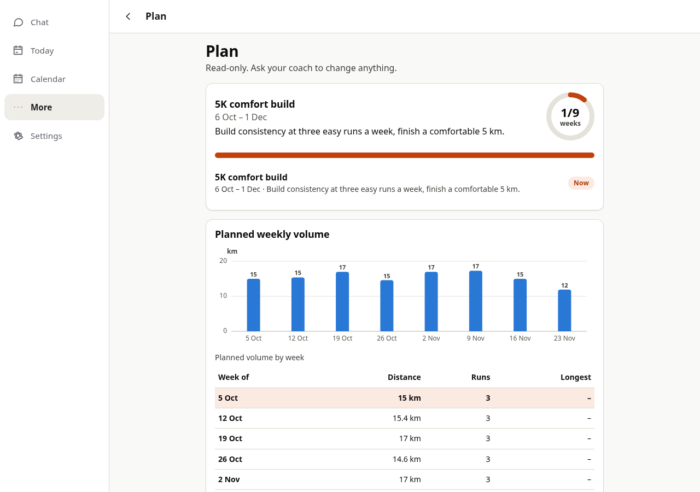
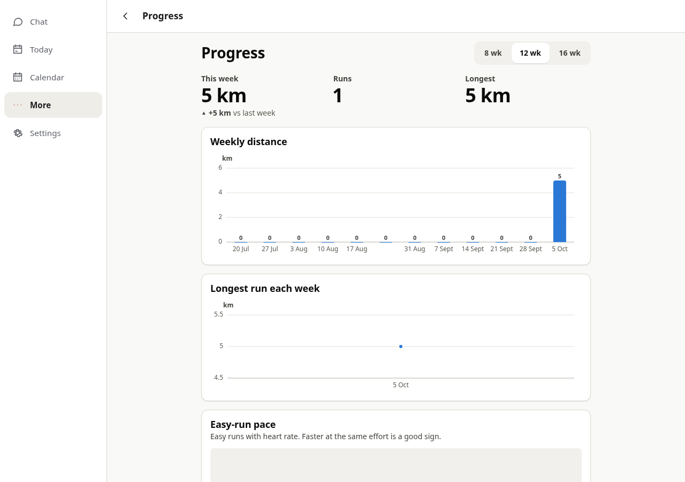

# OpenCode GO / DeepSeek V4.1 Flash smoke evidence

Observed on **6 October 2026** (Europe/Amsterdam). Application source was the restored `ccr-a500ac00-ytsl89` branch through `717a535`, including the exact `25799c1` handover source. The follow-up changes the provider example, its existing configuration test, and documentation; no runtime, engine, seed, or coaching policy changed.

## Setup and bounds

- Provider: `opencode-go`; model: **`deepseek-v4.1-flash`**; Chat Completions at `https://opencode.ai/zen/go/v1/chat/completions`.
- Official IDs/prices: <https://opencode.ai/docs/go/>. Unauthenticated documentation access returned HTTP 200 before the key was used. Proxy and CA trust were retained, with TLS verification enabled. Environment status reported connected/current observations, but HTTP policy state remained `unknown`; successful requests establish the tested destination's actual access.
- Key supplied only to the trusted server process, using a private ignored `work/` environment file during the run. No key in tracked files, images, browser state, or athlete sandboxes. The temporary key file was removed after testing.
- Node 22.23.3, pinned pnpm 10.28.0, Linux `local-isolated` namespaces, Chromium, built PWA and kit. Unsafe sandbox fallback was disabled. All athlete facts were synthetic.
- Two adapter requests, then three coach turns: first contact, intake, run/plan request. App limits: reactive 24 steps / 240 seconds, other 16 steps / 240 seconds, helper 8 steps / 90 seconds; 8192 output tokens per app request. Manual scheduler prevented unsolicited timer-driven model runs.
- Same model for coach/deep/fast, reasoning replay enabled, vision disabled. Fixed peak pricing: input $0.30 / output $1.20 / cache read $0.006 per million tokens.

## Observed results

| Check | Evidence |
|---|---|
| Streaming + actual tool call | Model streamed `record_probe` with `{distance_m: 5000, effort: 4}`; 16 tool-input deltas, then a complete valid call. Reasoning content was present. |
| Tool-result continuation | Actual result carried `OC-PROBE-742`; next model request accepted replay and returned that exact confirmation in three text deltas, ending normally. |
| Adapter usage | First: 359 uncached input / 85 output tokens. Continuation: 215 uncached / 256 cached input / 13 output. |
| Signup and delivered chat | Chromium completed setup and the three consent checks. Real welcome, intake reply with quick replies, and plan confirmation arrived in the PWA over WebSocket. Durable `coach.message` events and `message_state.delivery=sent` were inspected. Private assistant final text was not treated as delivery. |
| Persistent intake | Athlete profile, health and preferences files contained the stated age, 15 km/week baseline, Tue/Thu/Sat availability and 45-minute limit. Workspace Git commits and SQLite snapshots existed. |
| Structured activity | `coach.db.activities`: one manual 5000 m / 1920 s run, RPE 4, no sensor data invented in the recorded activity. Unknown start time was flagged in its extra metadata. |
| Plan data | One block and 24 workout rows. The model expanded the requested first-week plan into an eight-week block; this is a scope-following limitation, not a one-week-plan certification. |
| Schedule | Requested check-in persisted for **7 October 2026 at 08:00 Europe/Amsterdam**, stored as `2026-10-07T06:00:00.000Z`. An earlier intake follow-up was cancelled. The model also added a weekly Sunday review; future message frequency was not tested. |
| Today | Shows the completed 5 km run, 32:00 time and 6:24/km calculated pace. |
| Calendar | Shows saved workouts on their dates, including the completed run. |
| Plan | Shows the block, eight weekly volume rows, key sessions and coach-written notes. Waited for the asynchronous table query before capturing the screenshot. |
| Progress | Shows one run, 5 km this week and a 5 km longest run. |
| Isolation and restart | All four frames use a separate origin and `sandbox="allow-scripts"`. Reopened server, paired a device, read all four views, and reloaded with no browser/console errors or additional model turns. |
| Sandbox boundaries | A command in this athlete's isolated sandbox could not see `OPENCODE_GO_API_KEY` or its trusted file, write `/raw`, or open an outbound socket. |

The three coach turns ended `ok` in **4 / 6 / 16 model steps**. The model additionally started a background `ui-builder` helper. It was cancelled when the bounded smoke server shut down, after seven steps; no coach-authored UI publication is claimed. The seed views remained at version 1.

Reported app usage, including that helper: **69,222 uncached input, 866,048 cached input, 31,069 output tokens**. The local peak-rate estimate was **$0.063245688**. This is reported-token accounting, not a provider invoice or cost comparison; a cancelled in-flight request may have unreported usage. No evaluation cohort was run.

These screenshots come from the actual app with **synthetic data written by the live model**. They are not real athlete records or an endorsement of the plan:





## Docker and checks

The final `docker/server.Dockerfile` built successfully through the managed proxy with a mounted build CA. The image ran as uid/gid 1000 and reported `local-isolated`, `isolated: true`. Chromium verified setup/consent, delivered demo welcome, effort quick reply and journaling, all four separate-origin frames, and reload. Inside its athlete sandbox, pandas/numpy/scipy/matplotlib/fitdecode/gpxpy/duckdb/Pillow imports succeeded, and Python reported the injected virtual date `2030-03-10`. Docker browser checks used the demo; the paid GO app run used the host server.

Frozen installation with pnpm 10.28.0, aggregate typecheck and production build passed. The focused server configuration and compatible-provider/SDK contracts passed **34 tests across three files**. The earlier aggregate/offline/browser results remain recorded in [HANDOVER.md](../../HANDOVER.md); they were not rerun merely for documentation/configuration changes.

The first ad-hoc browser script had two test-assumption failures: it expected `5.0 km` instead of the UI's `5 km`, and looked for direct Plan/Progress tabs rather than More menu items. Readback corrected these assumptions and waited for asynchronous data. No application defect or harness-code fix was required.

## Still unverified

Full [MOD-2] provider conformance, safety scenarios and human coaching-quality evaluation are incomplete. In particular, no 200-call reliability cohort, image extraction, long-context retention, steering or future scheduled delivery was certified. The model's expanded planning scope and extra review schedule need evaluation before treating it as a reliably calibrated coach. Live voice, Web Push, Telegram, search/MCP service behavior and native SDK/device integration remain unverified. The background UI change attempt was cancelled and is not a publication result.

Start after exporting `OPENCODE_GO_API_KEY`:

```sh
export OPENCOACH_CONFIG="$PWD/opencoach.config.opencode-go.example.yaml"
export OPENCOACH_DATA_DIR="$PWD/.data"
OPENCOACH_DEMO=0 pnpm start
```

Open `http://localhost:8080` and use the printed setup code for a new deployment. The CLI does not load `.env` automatically. See [self-hosting](../self-hosting.md) for separate origins, isolation, mobile access and Compose configuration.
